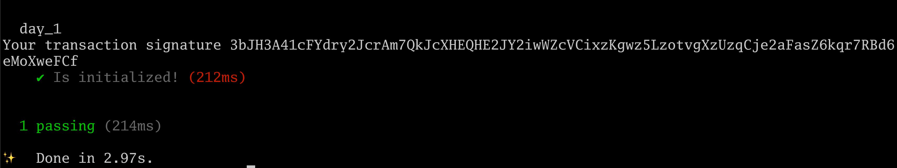
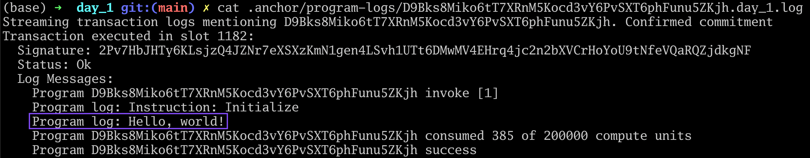
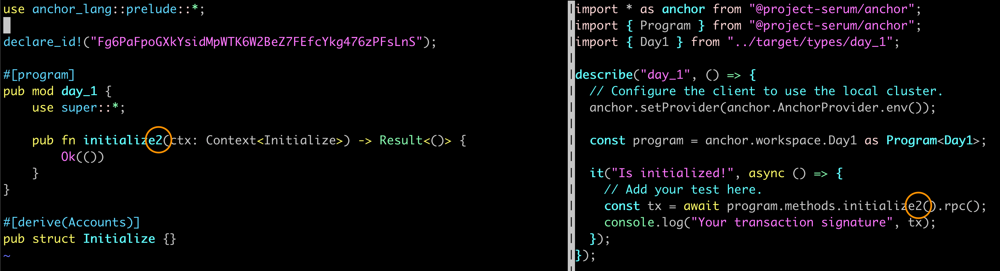
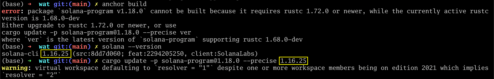

[Solana Hello World (Installation and Troubleshooting)](https://www.rareskills.io/post/hello-world-solana)

# Solana Hello World (Installation and Troubleshooting)

Updated: 4 days ago


This is a Solana hello world tutorial. We will walk you through the steps to install Solana and troubleshoot issues that may arise.

  

If you encounter an issue, please check the Troubleshooting section at the end of this article.

  

## Install Rust

Skip this if you already have Rust installed.

```bash
# install rust
curl --proto '=https' --tlsv1.2 -sSf https://sh.rustup.rs | sh
```


## Install Yarn

You will need this to run the unit tests. Skip this if you already have yarn installed.

```bash
# install yarn -- assumes node js is installed
corepack enable # corepack comes with node js
```

## Install the Solana cli

We strongly recommend using the stable version, not latest.

```bash
# install solana
sh -c "$(curl -sSfL https://release.solana.com/stable/install)"
```

## Install Anchor

Anchor is a framework for Solana development. It is quite similar to hardhat in many respects.

```bash
# install anchor
cargo install --git https://github.com/coral-xyz/anchor avm --locked --force

avm install latest
avm use latest
```

## Initialize and build an Anchor Program (for hello world)

**Mac users**: we recommend calling your program `day_1` instead of `day1` because Anchor seems to silently insert underscores on Mac machines sometimes.

```bash
anchor init day_1 # use day_1 if you have a mac
cd day1
anchor build
```
**To fix my problems !**

```bash
rustc --version
solana --version
anchor --version
```
```
rustc 1.76.0 (07dca489a 2024-02-04)
solana-cli 1.17.4 (src:2e5a20f7; feat:2295605592, client:SolanaLabs)
anchor-cli 0.29.0
```
`day01` --> `day_01`
`cargo update -p ahash@0.8.8 --precise 0.8.6`
`cargo update -p solana-program@1.18.1 --precise ver`

Where `ver` = `1.17.4`
`cargo update -p solana-program@1.18.1 --precise 1.17.4`

`anchor build`


Depending on your machine and internet connection, this step may take a while. This is also where you are likely to run into installation problems, so please see the troubleshooting section if necessary.

  

## Configure Solana to run on localhost

```bash
# shell 1
solana config set --url localhost
```

## Run the test validator node

Run the following command in a new shell, not in the Anchor project. But do not close the shell where you ran **anchor build**. This is running a local (test) Solana node instance on your machine:

```bash
# shell 2
solana-test-validator
```

## Ensure the program_id is synced with the Anchor key

Go back to the shell with the Anchor project and run the following command:

```bash
# shell 1
anchor keys sync
```
```
All program id declarations are synced.
```

## Run the tests

Run this in the Anchor project

```bash
# shell 1
anchor test --skip-local-validator
```

The command above runs the test for our program. If you have not already created a test wallet, Anchor will give you instructions for how to do so. We do not provide those instructions here because it will be dependent on your OS and file structure. You may also need to airdrop yourself some local Sol by running **solana airdrop 100 {YOUR_WALLET_ADDRESS}** in the terminal. You can get your wallet address by running `solana address` in the command line.

  

The expected output is as follows:



## Hello World

Now let’s make our program output "Hello, world!". Add the following line marked with **\*\*\*\* NEW LINE HERE \*\*\*\*** to `programs/day_1/src/lib.rs`.

```rust
use anchor_lang::prelude::*;

declare_id!("...");

#[program]
pub mod day_1 {
    use super::*;

    pub fn initialize(ctx: Context<Initialize>) -> Result<()> {
        msg!("Hello, world!"); // **** NEW LINE HERE ****
        Ok(())
    }
}

#[derive(Accounts)]
pub struct Initialize {}
```

**Run the test again**

```bash
anchor test --skip-local-validator
```

Find the log file by running

```bash
ls .anchor/program-logs/
```

Open that file to see the logged "Hello world"



```log
Streaming transaction logs mentioning CH6XVmiuwgHHv1FbhyAojB9cGX7zTdsSmNys5menUvj1. Confirmed commitment
Transaction executed in slot 1539:
  Signature: 38WBzGAgABZRdU7ogenKLwbw7j9gCXMdeVgutQCTEVCnmrKWb63nN5ZJ9FwtA8aahMkQQ1Xdef9KhErwVsNNzyi4
  Status: Ok
  Log Messages:
    Program CH6XVmiuwgHHv1FbhyAojB9cGX7zTdsSmNys5menUvj1 invoke [1]
    Program log: Instruction: Initialize
    Program log: Hello, world!
    Program CH6XVmiuwgHHv1FbhyAojB9cGX7zTdsSmNys5menUvj1 consumed 385 of 200000 compute units
    Program CH6XVmiuwgHHv1FbhyAojB9cGX7zTdsSmNys5menUvj1 success
```

## Realtime Solana logs

Alternatively, you can view the logs as the happen by opening a third shell and running

```bash
# shell 3
solana logs
```

Now run the test again, and you should see the same message in the terminal where you ran **solana logs**.

```log
Transaction executed in slot 2361:
  Signature: 4qWt7HyAZqnZH6dvojfSEME8uhpGpMsgJUtKzMd7TcRgz5d5ChuvZ9Ke3PaWWiLqbkaj3E2nkG8ABh7E8WFbsser
  Status: Ok
  Log Messages:
    Program CH6XVmiuwgHHv1FbhyAojB9cGX7zTdsSmNys5menUvj1 invoke [1]
    Program log: Instruction: Initialize
    Program log: Hello, world!
    Program CH6XVmiuwgHHv1FbhyAojB9cGX7zTdsSmNys5menUvj1 consumed 385 of 200000 compute units
    Program CH6XVmiuwgHHv1FbhyAojB9cGX7zTdsSmNys5menUvj1 success

```

## Questions and Answers

### Why do declare_id! and msg! have exclamation points after them?

In Rust, the exclamation point indicates that these are macros. We will revisit macros in a later tutorial.

  

### Do I need an initialize function?

No, that was autogenerated by the Anchor framework. You could name it whatever you like.

  

There is nothing special about the name initialize in this context, and so we can change the name to whatever we like. This is unlike some other keywords and languages, like how main is a special name in some languages, or how constructor is a special name in Solidity.

  

**Exercise**: Try renaming **initialize** in `programs/day_1/src/lib.rs` and **initialize** in `tests/day_1.ts` to become **initialize2** and run the test again. See the change marked in the orange circles below.



###   

  

### Why do we run the test with --skip-local-validator?

When the tests run against a node, we will be able to query the node for state changes. If you are not able to get the node to run, it is okay to run `anchor test` without the `--skip-local-validator` flag. However, you will have a harder time developing and testing, so we recommend getting the local validator to work.

  

## Troubleshooting

Solana is a rapidly developing software, and you may run into installation issues. We've documented the ones you are most likely to encounter the following sections.

  

Our tutorial series was written with the following versions:

- Anchor = version 0.29.0
- Solana = version 1.16.25
- Rustc = 1.77.0-nightly

You can change the Anchor version by running

```bash
avm install 0.29.0
avm use 0.29.0
```

You can change the Solana version simply by specifying the version in the curl command:

```bash
# install solana
sh -c "$(curl -sSfL https://release.solana.com/1.16.25/install)"
```

### error: package `solana-program v1.18.0` cannot be built

```
error: package `solana-program v1.18.0` cannot be built because it requires rustc 1.72.0 or newer, while the currently active rustc version is 1.68.0-dev
Either upgrade to rustc 1.72.0 or newer, or use
cargo update -p solana-program@1.18.0 --precise ver
```

Check the version of Solana you are running using `solana --version`. then plug that version into the **ver** above. An example resolution is shown below:


  

### error[E0658]: use of unstable library feature 'build_hasher_simple_hash_one'

If you get the following error:

```
error[E0658]: use of unstable library feature 'build_hasher_simple_hash_one'
--src/random_state.rs:463:5
|
463 | / fn hash_one<T: Hash>(&self, x: T) -u64 {
464 | | RandomState::hash_one(self, x)
465 | | }
| |_____^
|
= note: see issue [#86161](https://www.rareskills.io/blog/hashtags/86161) https://github.com/rust-lang/rust/issues/86161 for more information
= help: add #![feature(build_hasher_simple_hash_one)] to the crate attributes to enable
```

Run the following command: `cargo update -p ahash@0.8.7 --precise 0.8.6` Credit: [https://solana.stackexchange.com/questions/8800/cant-build-hello-world](https://solana.stackexchange.com/questions/8800/cant-build-hello-world)

  

### Error: Deploying program failed: Error processing Instruction 1: custom program error: 0x1

```
Error: Deploying program failed: Error processing Instruction 1: custom program error: 0x1
There was a problem deploying: Output { status: ExitStatus(unix_wait_status(256)), stdout: "", stderr: "" }.
```

If you get this error, your keys are not synced. Run `anchor keys sync`.


### Error: failed to send transaction: Transaction simulation failed: Attempt to load a program that does not exist

Your keys are not synced. Run `anchor keys sync`.

  

### Error: Your configured rpc port: 8899 is already in use

- You ran `anchor test` without `--skip-local-validator` while the validator is running in the background.
- Either turn off the validator and run `anchor test`
- Or run `anchor test --skip-local-validator` with the validator running.

Skip local validator means skip the temporary one it creates for the project, not the one running in the background.

  

### Error: Account J7t...zjK has insufficient funds for spend

Run the command below to `airdrop 100 SOL` to your development address

```bash
solana airdrop 100 J7t... ...zjK
```

### Error: RPC request error: cluster version query failed

```
Error: RPC request error: cluster version query failed: error sending request for url (http://localhost:8899/): error trying to connect: tcp connect error: Connection refused (os error 61)
There was a problem deploying: Output { status: ExitStatus(unix_wait_status(256)), stdout: "", stderr: "" }.
```

This means the `solana-test-validator` is not running in the background. Run `solana-test-validator` in another shell.


### thread 'main' panicked at 'called `Option::unwrap()` on a `None` value'

```
thread 'main' panicked at 'called `Option::unwrap()` on a `None` value', /Users/username/.cargo/git/checkouts/anchor-50c4b9c8b5e0501f/347c225/lang/syn/src/idl/file.rs:214:73
note: run with `RUST_BACKTRACE=1` environment variable to display a backtrace
```

It's likely you **didn't run** `anchor build` **yet**.


### I’m using Mac and I get Error: failed to start validator: Failed to create ledger at test-ledger: blockstore error

Follow the instructions in this [Stack Exchange thread](https://solana.stackexchange.com/questions/4499/cant-start-solana-test-validator-on-macos-13-0-1/4761#4761).

  

### I don’t have corepack on my Mac despite having node.js

Run the following commands

```bash
brew install corepack
brew link --overwrite corepack
```

Credit: [https://stackoverflow.com/questions/70082424/command-not-found-corepack-when-installing-yarn-on-node-v17-0-1](https://stackoverflow.com/questions/70082424/command-not-found-corepack-when-installing-yarn-on-node-v17-0-1)

  

### error: not a directory:

```
BPF SDK: /Users/rareskills/.local/share/solana/install/releases/stable-43daa37937907c10099e30af10a5a0b43e2dd2fe/solana-release/bin/sdk/bpf
cargo-build-bpf child: rustup toolchain list -v
cargo-build-bpf child: rustup toolchain link bpf /Users/rareskills/.local/share/solana/install/releases/stable-43daa37937907c10099e30af10a5a0b43e2dd2fe/solana-release/bin/sdk/bpf/dependencies/bpf-tools/rust
error: not a directory:
```

clear the cache: run `rm -rf ~/.cache/solana/*`

### Error: target/idl/day_1.json doesn't exist. Did you run `anchor build`?

Create a new project and name it `day_1` instead of `day1`. Anchor seems to silently insert underscores on some machines.