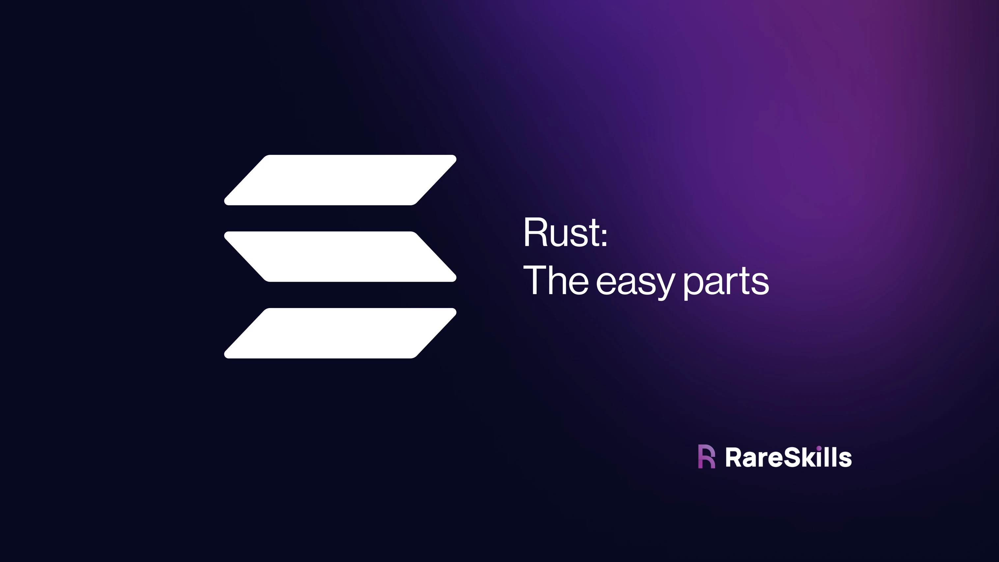
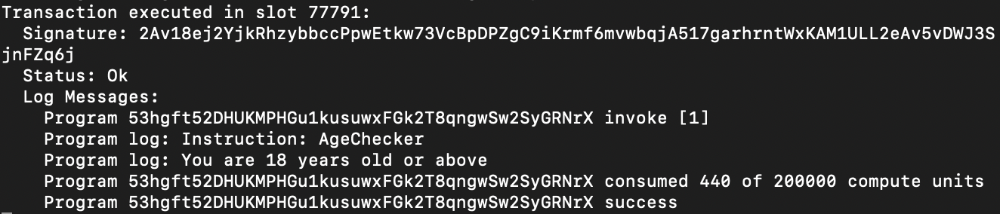
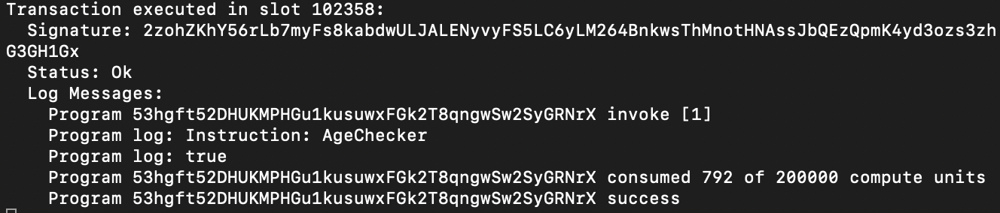
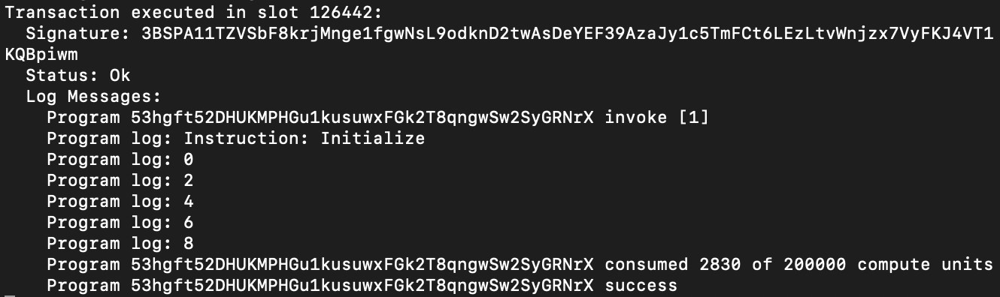
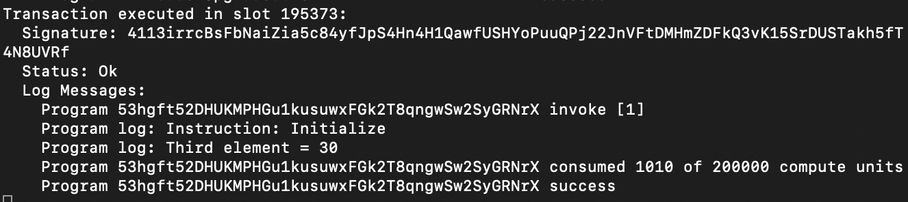
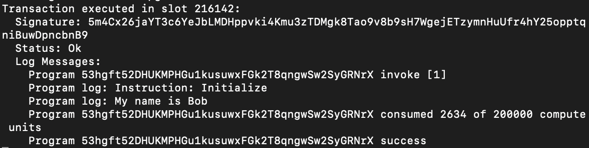

[Basic Rust for Solidity Developers](https://www.rareskills.io/post/rust-basic-syntax)

# Basic Rust for Solidity Developers




This tutorial goes over the most commonly used syntax in Solidity and demonstrates the equivalent in Rust.

If you want a high level overview of the differences of [Rust vs Solidity](https://www.rareskills.io/post/solidity-vs-rust) please see the linked tutorial. This tutorial assumes you already know Solidity, so please see our free [Solidity tutorial](http://rareskills.io/learn-solidity) if you are unfamiliar with Solidity.

> Create a **new Solana Anchor project** called `tryrust` and set up the environment.

```bash
anchor init tryrust
cd tryrust
anchor build
cargo update -p solana-program@1.18.2 --precise 1.17.4
anchor build
cargo update -p ahash@0.8.8 --precise 0.8.6
anchor build
```

## Conditional statements

We can say there are 2 ways developers can control the flow of execution based on a specific condition in Solidity:

- If-Else Statements
- Ternary operator

Now let’s see the above in Solidity, and their translations to Solana.


### If-Else Statements

**In Solidity:**

```solidity
function ageChecker(uint256 age) public pure returns (string memory) {
  if (age >= 18) {
      return "You are 18 years old or above";
  } else {
    return "You are below 18 years old";
  }
}
```

**In Solana**, add a new function called `age_checker` in [lib.rs](http://lib.rs):

```rust
pub fn age_checker(ctx: Context<Initialize>,
                   age: u64) -> Result<()> {
    if age >= 18 {
        msg!("You are 18 years old or above");
    } else {
        msg!("You are below 18 years old");
    }
    Ok(())
}
```

Note that the condition **age >= 18** does not have parenthesis — those are optional for if statements.

To test, add another it block in `./tests/tryrust.ts`:

```javascript
it("Age checker", async () => { // Add your test here. const tx = await program.methods.ageChecker(new anchor.BN(35)).rpc();
    console.log("Your transaction signature", tx);
}); 
```

We should have the following logs after running the test:

`anchor test --skip-local-validator`



### Ternary operator

Assigning if-else statement to a variable in Solidity:

```solidity
function ageChecker(uint256 age) public pure returns (bool a) {
	a = age % 2 == 0 ? true : false;
} 
```

To do this in Solana, we basically just assign an if-else statement to a variable. The Solana program below is the same as the above:

```rust
pub fn age_checker(ctx: Context<Initialize>,
                   age: u64) -> Result<()> {

    let result = if age >= 18 {
        "You are 18 years old or above"
    } else {
        "You are below 18 years old"
    };
    msg!("{:?}", result);
    Ok(())
}
```

Note that in the Ternary Operator example in Rust the if/else block ends with a semi colon as this is being assigned to a variable.


Also notice that the inner values do not have a semicolon at the end because it is being returned as the return value to the variable, similar to how you don’t put a semicolon after `Ok(())` as it’s an expression and not a statement.

Program logs out true if age is even, else false:



Rust has one more powerful control flow construct called [**match**](https://doc.rust-lang.org/book/ch06-02-match.html). Let’s see an example of using match below:

```rust
pub fn age_checker(ctx: Context<Initialize>,
                   age: u64) -> Result<()> {
	match age {
        1 => {
            // Code block executed if age equals 1
            msg!("The age is 1");
        },
        2 | 3 => {
            // Code block executed if age equals 2 or 3
            msg!("The age is either 2 or 3");
        },
        4..=6 => {
            // Code block executed if age is in the 
		    // range 4 to 6 (inclusive)
            msg!("The age is between 4 and 6");
        },
        _ => {
            // Code block executed for any other age
            msg!("The age is something else");
        }
    }

	Ok(())
}
```

## For Loops

As we know, for loop allows looping over ranges, collections, and other iterable objects and it is written **in Solidity** like so:

```solidity
function loopOverSmth() public {
  for (uint256 i=0; i < 10; i++) {
    // do something...
  }
}
```

This is the equivalent **in Solana (Rust)**:

```rust
pub fn initialize(ctx: Context<Initialize>) -> Result<()> {
    for i in 0..10 {
        // do something...
    }
        
    Ok(())
}
```

Yes, it’s that simple, but how do we iterate over a range with a custom step? Here is the intended behavior in Solidity:

```solidity
function loopOverSmth() public {
    for (uint256 i=0; i < 10; i+=2) {
        // do something...

        // Increment i by 2
    }
}
```

Here is the equivalent in Solana using `step_by`:

```rust
pub fn initialize(ctx: Context<Initialize>) -> Result<()> {
    for i in (0..10).step_by(2) {
        // do something...
        msg!("{}", i);
    }

    Ok(())
}
```

Running the test, we should have the following logs:




## Arrays and Vectors

Rust differs from Solidity in terms of array support. While Solidity has native support for both fixed and dynamic arrays, Rust only has built-in support for fixed arrays. **If you want a dynamic-length list, use a vector**.


Now, let's look at some examples that demonstrate how to declare and initialize both **fixed** and **dynamic** arrays.


### Fixed array

```rust
pub fn initialize(ctx: Context<Initialize>) -> Result<()> {
    // Declare an array of u32 with a fixed size of 5
    let my_array: [u32; 5] = [10, 20, 30, 40, 50];

    // Accessing elements of the array
    let first_element = my_array[0];
    let third_element = my_array[2];

    // Declare a mutable array of u32 with a fixed size of 3
    let mut mutable_array: [u32; 3] = [100, 200, 300];

    // Change the second element from 200 to 250
    mutable_array[1] = 250;

    // Rest of your program's logic

    Ok(())
}
```

### Dynamic array

A method to simulate a dynamic array in Solana involves utilizing a Vec (Vector) from the Rust standard library. Here is an example below:

```rust
pub fn initialize(ctx: Context<Initialize>) -> Result<()> {
    // Declare a dynamic array-like structure using Vec
    let mut dynamic_array: Vec<u32> = Vec::new();

    // Add elements to the dynamic array
    dynamic_array.push(10);
    dynamic_array.push(20);
    dynamic_array.push(30);

    // Accessing elements of the dynamic array
    let first_element = dynamic_array[0];
    let third_element = dynamic_array[2];

    // Rest of your program's logic
    msg!("Third element = {}", third_element);

    Ok(())
}
```

The `dynamic_array` variable must be declared as mutable (`mut`) to allow mutating (push, pop, override at an index, etc).

Program should log this after running the test:



## Mappings

Unlike Solidity, Solana lacks a built-in mapping data structure. However, we can replicate the key-value mappings functionality in Solana by utilizing the [HashMap](https://doc.rust-lang.org/std/collections/struct.HashMap.html) type from the Rust standard library. **Unlike EVM chains, the map we are demonstrating here is in memory, not storage. EVM chains do not have in-memory hash maps**. We will demonstrate mappings in storage for Solana later.

Let’s see how to use **HashMap** to create a mapping in Solana. Copy and paste the provided code snippet into the [lib.rs](http://lib.rs) file, and remember to replace the **program ID** with your own:

```rust
use anchor_lang::prelude::*;

declare_id!("53hgft52DHUKMPHGu1kusuwxFGk2T8qngwSw2SyGRNrX");

#[program]
pub mod tryrust {
    use super::*;
    use std::collections::HashMap;  // Import HashMap library

    pub fn initialize(ctx: Context<Initialize>, key: String, value: String) -> Result<()> {
        // Initialize the mapping
        let mut my_map = HashMap::new();

        // Add a key-value pair to the mapping
        my_map.insert(key.to_string(), value.to_string());

        // Log the value corresponding to a key from the mapping
        msg!("My name is {}", my_map[&key]);

        Ok(())
    }
}
```

The `my_map` variable is also made **mutable** so that we can edit it (*i.e, add/remove key → value pairs*). Also noticed how we imported HashMap library ?

`use std::collections::HashMap;`

Since the initialize function receives two parameters, the test also needs to be updated:

```javascript
it("Is initialized!", async () => { // Add your test here.
    const tx = await program.methods.initialize("name", "Bob").rpc();
    console.log("Your transaction signature", tx);
}); 
```

When we run the test, we see the following log:




## Structs

In Solidity and Solana, structs are used to define custom data structures that can hold multiple fields. Let’s see a struct example in both Solidity and Solana.

**In Solidity:**

```solidity
contract SolidityStructs { // Defining a struct in Solidity
    struct Person { string my_name; uint256 my_age;
    } // Creating an instance of the struct Person person1;
    function initPerson1(string memory name, uint256 age) public { // Accessing and modifying struct fields person1.my_name = name;
        person1.my_age = age;
    }
} 
```

**The 1-1 correspondence in Solana (Rust) :**

```rust
pub fn initialize(_ctx: Context<Initialize>, name: String, age: u64) -> Result<()> {
    // Defining a struct in Solana
    struct Person {
        my_name: String,
        my_age: u64,
    }

    // Creating an instance of the struct
    let mut person1: Person = Person {
        my_name: name,
        my_age: age,
    };

    msg!("{} is {} years old", person1.my_name, person1.my_age);

    // Accessing and modifying struct fields
    person1.my_name = "Bob".to_string();
    person1.my_age = 18;

    msg!("{} is {} years old", person1.my_name, person1.my_age);

    Ok(())
}
```

**Exercise**: update the test file to pass two arguments Alice and 20 to the initialize function and run the test, you should get the following logs:


In the provided code snippet, the Solidity implementation stores the instance of a struct in storage, whereas in the Solana implementation, everything happened in the initialize function and nothing was stored on-chain. Storage will be discussed in a later tutorial.


## Constants in Rust

Declaring a constant variable in Rust is straightforward. Instead of using the `let` keyword, use the **`const` keyword**. These can be declared outside of the **#[program]** block.

```rust
use anchor_lang::prelude::*;

declare_id!("EiR8gcMCX11tYMRfoZ2vyheZsZ2NvdUTvYrRAUvTtYnL");

// *** CONSTANT DECLARED HERE ***
const MEANING_OF_LIFE_AND_EXISTENCE: u64 = 42;

#[program]
pub mod tryrust {
    use super::*;

    pub fn initialize(ctx: Context<Initialize>) -> Result<()> {
        msg!(&format!("Answer to the ultimate question: {}", MEANING_OF_LIFE_AND_EXISTENCE)); // new line here
        Ok(())
    }
}

#[derive(Accounts)]
pub struct Initialize {}
```


## The usize type and casting

Most of the time we can assume unsigned integers are of type `u64` in Solana, but there is an exception when measuring the length of a list: it will be of type `usize`. You will need to cast the variable as the following Rust code demonstrate:

```rust
use anchor_lang::prelude::*;

declare_id!("EiR8gcMCX11tYMRfoZ2vyheZsZ2NvdUTvYrRAUvTtYnL");

#[program]
pub mod usize_example {
    use super::*;

    pub fn initialize(ctx: Context<Initialize>) -> Result<()> {

       let mut dynamic_array: Vec<u32> = Vec::from([1,2,3,4,5,6]);
       let len = dynamic_array.len(); // this has type usize
       
       let another_var: u64 = 5; // this has type u64

       let len_plus_another_var = len as u64 + another_var;

       msg!("The result is {}", len_plus_another_var);

       Ok(())
    }
}

#[derive(Accounts)]
pub struct Initialize {}
```


## Try Catch

**Rust does not have `try` / `catch`  **. Failures are expected to return errors (like we did in our tutorial on Solana reverts and errors) or panic for non-recoverable errors.


**Exercise**: Write a Solana / Rust program that takes a vector of u64, loops through it, and pushes all the even numbers into another vector, then prints the new vector.