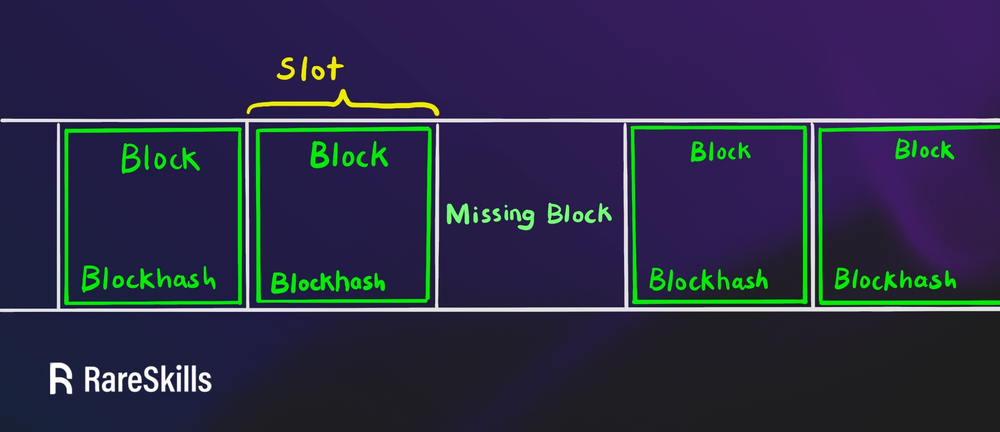
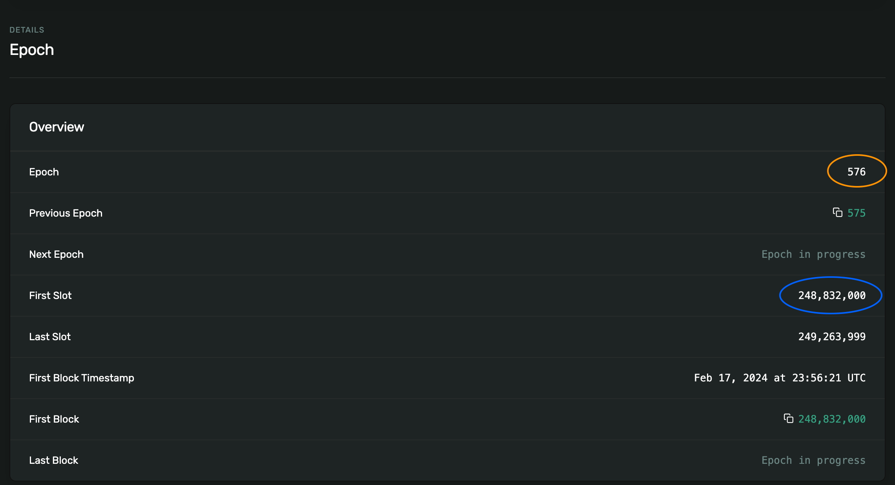

[Solana Sysvars Explained](https://www.rareskills.io/post/solana-sysvar)

# Solana Sysvars Explained


In Solana, **sysvars** are **read-only system accounts** that give Solana programs **access to the blockchain state** as well as **network information**. They are similar to Ethereum global variables, which also enable smart contracts to access network or blockchain state information, but they have unique public addresses like the Ethereum precompiles.

In **Anchor** programs, you can **access sysvars** in two ways:
- Either by using the anchor’s get method wrapper.
- Or by treating it as an account in your `#[Derive(Accounts)]`, using its public address.

Not all sysvars support the `get` method, and some are deprecated (*information on deprecation will be specified in this guide*). For those sysvars that don't have a `get` method, we will access them using their public address.

- **Clock**: Used for time-related operations like getting the current time or slot number.
- **EpochSchedule**: Contains information about epoch scheduling, including the epoch for a particular slot.
- **Rent**: Contains the rental rate and information like the minimum balance requirements to keep an account rent exempt.
- **Fees**: Contains the fee calculator for the current slot. The fee calculator provides information on how many lamports are paid per signature in a Solana transaction.
- **EpochRewards**: The EpochRewards sysvar holds a record of epoch rewards distribution in Solana, including block rewards and staking rewards.
- **RecentBlockhashes**: Contains the active recent block hashes.
- **SlotHashes**: Contains history of recent slot hashes.
- **SlotHistory**: Holds an array of slots available during the most recent epoch in Solana, and it is updated every time a new slot is processed.
- **StakeHistory**: maintains a record of stake activations and deactivations for the entire network on a per-epoch basis, which is updated at the beginning of each epoch.
- **Instructions**: To get access to the serialized instructions that are part of the current transaction.
- **LastRestartSlot**: Contains the slot number of the last restart (*the last time Solana restarted*) or zero if none ever happened. If the Solana blockchain were to crash and restart, an application can use this information to determine if it should wait until things stabilize.

> **Note :** Le terme **"Lamport"** fait référence à l'algorithme de synchronisation d'horloge utilisé pour maintenir la cohérence de l'horloge entre les nœuds du réseau. Cet algorithme est nommé d'après son inventeur, **Leslie Lamport**, un informaticien et lauréat du prix Turing.

> L'algorithme de Lamport est essentiel dans le protocole de consensus de Solana pour garantir que tous les nœuds du réseau sont synchronisés et ont une compréhension commune du temps. Créant un ordre temporel pour les transactions et les événements sur la blockchain Solana.

> Les nœuds du réseau Solana peuvent maintenir une synchronisation de l'horloge même en présence de latence réseau et de délais variables entre les nœuds. Cela contribue à assurer que tous les validateurs du réseau arrivent à un consensus sur l'ordre des transactions et des événements.


## Differentiating between Solana slots and blocks.

- A **slot** is a window of time (*about 400ms*) where a designated leader can produce a block.
- A slot contains a **block** (*the same kind of block on Ethereum, i.e a list of transactions*).
- However, a slot might not contain a block if the block leader failed to produce a block during that slot.

Their relationship is illustrated below:



Although!
- **Every block maps to exactly one slot**
- The **block hash** is **not** the **same** as the **slot hash**.

This distinction is evident when clicking on a slot number in an explorer, it opens up the details of a block with a different hash.

Let's take an example from the image below from the Solana block explorer:


- The highlighted **green** number in the image is the slot number **237240962**
- And the highlighted **yellow text** is the slot hash **DYFtWxEdLbos9E6SjZQCMq8z242Yv2bVoj6dzwskd5vZ**.
- The block hash highlighted in **red** below is **FzHwFHDAXJBc55rpjShznGCBnC7DsTCjxf3KKAk6hk9T**.

(Other block details are cropped out):


We can distinguish between a block and a slot by their unique hashes, even though they have the same numbers.

As a test, click on any slot number in the explorer [**here**](https://explorer.solana.com/address/SysvarS1otHashes111111111111111111111111111/slot-hashes?cluster=testnet) and you will notice that a block page will open. This **block (hash)** will have a **different** hash from the **slot hash**.


## Accessing Solana Sysvars in Anchor, using the get method

As mentioned earlier, not all sysvars can be accessed using Anchor’s get method. **Sysvars** such as **Clock**, **EpochSchedule**, and **Rent** can be accessed using this method.

While the Solana documentation includes Fees and EpochRewards as sysvars that can be accessed with the get method, these are **deprecated** in the latest version of Anchor. Therefore, they cannot be called using the get method in Anchor.

We will access and log the contents of all currently supported sysvars using the get method. To begin, we create a **new Anchor project**:

```bash
anchor init sysvars
cd sysvars
anchor build
cargo update -p solana-program@1.18.2 --precise 1.17.4
anchor build
cargo update -p ahash@0.8.9 --precise 0.8.6
anchor build
ls -la

cargo update -p ahash@0.8.9 --precise 0.8.6

```


### Clock sysvar

To utilize the **Clock sysvar**, we can invoke the `Clock::get()` (*we did something similar in a previous tutorial*) method as demonstrated below.

Add the following code in the `initialize()` function of our project:

```rust
pub fn initialize(ctx: Context<Initialize>) -> Result<()> {
    // Get the Clock sysvar
    let clock = Clock::get()?;

    msg!(
        "clock: {:?}",
        // Retrieve all the details of the Clock sysvar
        clock
    );

    Ok(())
}
```

Now, run the test on a local Solana node and check the log:
- `anchor test --skip-local-validator`
- `solana-test-validator` (in another terminal)
- `solana logs` (in another terminal)

You should see something like this:


```
Program log: clock: Clock { slot: 31709, epoch_start_timestamp: 1708073675, epoch: 0, leader_schedule_epoch: 1, unix_timestamp: 1708105383 }
```

### EpochSchedule sysvar

An **epoch** in Solana is a period of time that is approximately two days long. SOL can only be staked or unstaked at the start of an epoch. If you stake (*or unstake*) **SOL** before the end of an epoch, the SOL is marked as **“activating”** or **“deactivating”** while waiting for the epoch to end.

Solana describes this more in their description of [**delegating SOL**](https://solana.com/id/staking#overview/delegation-timing-considerations).

We can access the **EpochSchedule** sysvar using the `get` method, similar to the **Clock** sysvar.

Update the initialize function with the following code:

```rust
pub fn initialize(ctx: Context<Initialize>) -> Result<()> {
    // Previous code...

    // Get the EpochSchedule sysvar
    let epoch = EpochSchedule::get()?;

    msg!(
        "epoch: {:?}",
        // Retrieve all the details of the EpochSchedule sysvar
        epoch
    );

    Ok(())
}
```

After running the test again, the following **log** will be generated:


```
Program log: epoch: EpochSchedule { slots_per_epoch: 432000, leader_schedule_slot_offset: 432000, warmup: false, first_normal_epoch: 0, first_normal_slot: 0 }
```

From the log, we can observe that the EpochSchedule sysvar contains the following fields:

- **slots_per_epoch** highlighted in **yellow** holds the number of slots in each epoch, which is 432,000 slots here.
- **leader_schedule_slot_offset** highlighted in **red** determines the timing for the next epoch's leader schedule (we had previously talked about this in day 11). It's also set to 432,000.
- **warmup** highlighted in **purple** is a boolean that indicates whether Solana is in the warm-up phase. During this phase, epochs start smaller and gradually increase in size. This helps the network start smoothly after a reset or during its early days.
- **first_normal_epoch** highlighted in **orange** identifies the first epoch that can have its slot count
- And **first_normal_slot** highlighted in **blue** is the slot that starts this epoch. In this case both are 0 (zero).

> The reason we see the **first_normal_epoch** and **first_normal_slot** being 0 is because the test validator hasn’t been running for two days. If we were to run this command on the mainnet (*at time of writing*), we would expect to see the **first_normal_epoch** being **576** and the **first_normal_slot** being **248,832,000**.




### Rent sysvar

Once again, we use the `get` method to access the **Rent** sysvar.

We update the initialize function with the following code:

```rust
pub fn initialize(ctx: Context<Initialize>) -> Result<()> {
    // Previous code...

    // Get the Rent sysvar
    let rent_var = Rent::get()?;
    msg!(
        "Rent {:?}",
        // Retrieve all the details of the Rent sysvar
        rent_var
    );

    Ok(())
}
```

Run the test, we get this **log**:


```
Program log: Rent Rent { lamports_per_byte_year: 3480, exemption_threshold: 2.0, burn_percent: 50 }
```

The Rent sysvar in Solana has three key fields:

- **lamports_per_byte_year**
- **exemption_threshold**
- **burn_percent**

----
- The **lamports_per_byte_year** highlighted in **yellow** indicates the number of lamports required per byte per year for rent exemption.
- The **exemption_threshold** highlighted in **red** is a multiplier used to calculate the minimum balance needed for rent exemption. In this example, we see we need to pay **3480 x 2 = 6960** lamports per byte to create a new account.
- 50% of that is burned (**burn_percent** highlighted in **purple**) to manage Solana inflation.

The concept of **"rent"** will be fully explained in a later tutorial.


## Accessing Sysvars in Anchor Using Sysvar Public Address

For sysvars that don't support the get method, we can access them using their public addresses. Any exceptions to this will be specified.


### StakeHistory sysvar

Recall that we previously mentioned that this sysvar keeps a record of stake activations and deactivations for the entire network on a per-epoch basis. However, since we are running a local validator node, this sysvar will return empty data.

We will access this sysvar using its public address

**SysvarStakeHistory1111111111111111111111111**.

First, we modify the **Initialize** account struct in our project as follows:

```rust
#[derive(Accounts)]
pub struct Initialize<'info> {
    /// CHECK:
    pub stake_history: AccountInfo<'info>, // We create an account for the StakeHistory sysvar
}
```

We ask the reader to treat the new syntax as **boilerplate** for now. The /`// CHECK:` and `AccountInfo` will be explained in a later tutorial.

For the curious, the `<’info>` token is a [**Rust lifetime**](https://web.mit.edu/rust-lang_v1.25/arch/amd64_ubuntu1404/share/doc/rust/html/book/first-edition/lifetimes.html).

Next, we add the following code to the `initialize()` function.

(*The reference to the sysvar account will be passed in as part of the transaction in our test. The previous examples had them built into the Anchor framework*).

```rust
pub fn initialize(ctx: Context<Initialize>) -> Result<()> {
    // Previous code...

    // Accessing the StakeHistory sysvar
    // Create an array to store the StakeHistory account
    let arr = [ctx.accounts.stake_history.clone()];

    // Create an iterator for the array
    let accounts_iter = &mut arr.iter();

    // Get the next account info from the iterator (still StakeHistory)
    let sh_sysvar_info = next_account_info(accounts_iter)?;

    // Create a StakeHistory instance from the account info
    let stake_history = StakeHistory::from_account_info(sh_sysvar_info)?;

    msg!("stake_history: {:?}", stake_history);

    Ok(())
}
```

We are not importing the **StakeHistory** sysvar because we can access it through the use of the `super::*; import`. If this is not the case, we will import the specific sysvar.

And update the test:

```javascript
// NOT GOOD !
```

Now, we re-run our test:


Just as mentioned earlier, it returns empty data for our local validator.

We can also obtain the public key of the **StakeHistory** sysvar from the Anchor Typescript client by replacing our `StakeHistory_PublicKey` variable with `anchor.web3.SYSVAR_STAKE_HISTORY_PUBKEY`.

### RecentBlockhashes sysvar

How to access this sysvar was discussed in our [**previous tutorial**](https://www.rareskills.io/post/solana-clock). As a reminder, it is **deprecated** and support will be dropped.

### Fees sysvar

The Fees sysvar is also deprecated.

### Instruction sysvar

This sysvar can be used to access the serialized instructions of the current transaction, along with some metadata that are part of that transaction. We will demonstrate this below.

First, we update our imports:

```rust
#[program]
pub mod sysvars {
    use super::*;
    use anchor_lang::solana_program::sysvar::{instructions, fees::Fees, recent_blockhashes::RecentBlockhashes};
    // rest of the code
}
```

Next, we add the Instruction sysvar account to the **Initialize** account struct:

```rust
#[derive(Accounts)]
pub struct Initialize<'info> {
    /// CHECK:
    pub stake_history: AccountInfo<'info>, // We create an account for the StakeHistory sysvar
    /// CHECK:
    pub recent_blockhashes: AccountInfo<'info>,
    /// CHECK:
    pub instruction_sysvar: AccountInfo<'info>,
}
```

Now, modify the `initialize()` function to accept a `number: u32` parameter and add the following code to the initialize function.

```rust
pub fn initialize(ctx: Context<Initialize>, number: u32) -> Result<()> {
    // Previous code...

    // Get Instruction sysvar
    let arr = [ctx.accounts.instruction_sysvar.clone()];

    let account_info_iter = &mut arr.iter();

    let instructions_sysvar_account = next_account_info(account_info_iter)?;

    // Load the instruction details from the instruction sysvar account
    let instruction_details = instructions::load_instruction_at_checked(0, instructions_sysvar_account)?;

    msg!(
        "Instruction details of this transaction: {:?}",
        instruction_details
    );
    msg!("Number is: {}", number);

    Ok(())
}
```

In contrast to the previous sysvar, where we used `<sysvar_name>::from_account_info()` to retrieve the sysvar, in this case, we utilize the `load_instruction_at_checked()` method from the Instruction sysvar. This method requires the instruction data index (*0 in this case*) and the Instruction sysvar account as parameters.

Update the test:

```javascript
import * as anchor from "@coral-xyz/anchor";
import { Program } from "@coral-xyz/anchor";
import { Sysvars } from "../target/types/sysvars";

describe("sysvars", () => {
  // Configure the client to use the local cluster.
  anchor.setProvider(anchor.AnchorProvider.env());

  const program = anchor.workspace.Sysvars as Program<Sysvars>;

  // Create a StakeHistory PublicKey object
  const StakeHistory_PublicKey = new anchor.web3.PublicKey(
    "SysvarStakeHistory1111111111111111111111111"
  );

  it("Is initialized!", async () => {
    // Add your test here.
    const tx = await program.methods
      .initialize(3) // Call the initialze function with the number `3`
      .accounts({
        stakeHistory: StakeHistory_PublicKey, // pass the public key of StakeHistory sysvar to the list of accounts needed for the instruction
        recentBlockhashes: anchor.web3.SYSVAR_RECENT_BLOCKHASHES_PUBKEY, // pass the public key of RecentBlockhashes sysvar to the list of accounts needed for the instruction
        instructionSysvar: anchor.web3.SYSVAR_INSTRUCTIONS_PUBKEY, // Pass the public key of the Instruction sysvar to the list of accounts needed for the instruction
      })
      .rpc();
    console.log("Your transaction signature", tx);
  });
});
```

And run the test:

```
Status: Ok
Log Messages:
  Program 6aHtT7SNv7myvhZCPBUGsXmUuatTs4jqygHFNmcMDmS9 invoke [1]
  Program log: Instruction: Initialize
  Program log: clock: Clock { slot: 37261, epoch_start_timestamp: 1708073675, epoch: 0, leader_schedule_epoch: 1, unix_timestamp: 1708110935 }
  Program log: epoch: EpochSchedule { slots_per_epoch: 432000, leader_schedule_slot_offset: 432000, warmup: false, first_normal_epoch: 0, first_normal_slot: 0 }
  Program log: Rent Rent { lamports_per_byte_year: 3480, exemption_threshold: 2.0, burn_percent: 50 }
  Program log: Instruction details of this transaction: Instruction { program_id: 6aHtT7SNv7myvhZCPBUGsXmUuatTs4jqygHFNmcMDmS9, accounts: [AccountMeta { pubkey: SysvarStakeHistory1111111111111111111111111, is_signer: false, is_writable: false }, AccountMeta { pubkey: SysvarRecentB1ockHashes11111111111111111111, is_signer: false, is_writable: false }, AccountMeta { pubkey: Sysvar1nstructions1111111111111111111111111, is_signer: false, is_writable: false }], data: [175, 175, 109, 31, 13, 152, 155, 237, 3, 0, 0, 0] }
  Program log: Number is: 3
  Program log: stake_history: StakeHistory([])
  Program 6aHtT7SNv7myvhZCPBUGsXmUuatTs4jqygHFNmcMDmS9 consumed 68536 of 200000 compute units
  Program 6aHtT7SNv7myvhZCPBUGsXmUuatTs4jqygHFNmcMDmS9 success
```
```json
Instruction {
  program_id: 6aHtT7SNv7myvhZCPBUGsXmUuatTs4jqygHFNmcMDmS9,
  accounts: [
    AccountMeta {
      pubkey:      SysvarStakeHistory1111111111111111111111111,
      is_signer:   false,
      is_writable: false
    },
    AccountMeta {
      pubkey:      SysvarRecentB1ockHashes11111111111111111111,
      is_signer:   false,
      is_writable: false
    },
    AccountMeta {
      pubkey:      Sysvar1nstructions1111111111111111111111111, 
      is_signer:   false,
      is_writable: false
    }
  ],
  data: [175, 175, 109, 31, 13, 152, 155, 237, 3, 0, 0, 0]
}
```


If we closely examine the log, we can see the program Id, the public key of the sysvar instruction, the serialized data, and other metadata.

We can also see the number **3** highlighted with the **yellow** arrow in both the serialized instruction data and our own program log. The **serialized data** highlighted in **red** is a discriminator injected by Anchor (*we can ignore that*).

> data: [175, 175, 109, 31, 13, 152, 155, 237, **3**, 0, 0, 0]

> Program log: Number is: **3**

**Exercise**: Access the **LastRestartSlot** sysvar

**SysvarLastRestartS1ot1111111111111111111111** using the method used above. Note that Anchor does not have the address for this sysvar, so you will need to create a **PublicKey** object.

See : [**Solana Sysvar Cluster Data**](https://docs.solanalabs.com/runtime/sysvars)


```
  Status: Ok
  Log Messages:
    Program 6aHtT7SNv7myvhZCPBUGsXmUuatTs4jqygHFNmcMDmS9 invoke [1]
    Program log: Instruction: Initialize
    Program log: clock: Clock { slot: 43452, epoch_start_timestamp: 1708073675, epoch: 0, leader_schedule_epoch: 1, unix_timestamp: 1708117126 }
    Program log: epoch: EpochSchedule { slots_per_epoch: 432000, leader_schedule_slot_offset: 432000, warmup: false, first_normal_epoch: 0, first_normal_slot: 0 }
    Program log: Rent Rent { lamports_per_byte_year: 3480, exemption_threshold: 2.0, burn_percent: 50 }
    Program log: Instruction details of this transaction: Instruction { program_id: 6aHtT7SNv7myvhZCPBUGsXmUuatTs4jqygHFNmcMDmS9, accounts: [AccountMeta { pubkey: SysvarStakeHistory1111111111111111111111111, is_signer: false, is_writable: false }, AccountMeta { pubkey: SysvarRecentB1ockHashes11111111111111111111, is_signer: false, is_writable: false }, AccountMeta { pubkey: Sysvar1nstructions1111111111111111111111111, is_signer: false, is_writable: false }, AccountMeta { pubkey: SysvarLastRestartS1ot1111111111111111111111, is_signer: false, is_writable: false }], data: [175, 175, 109, 31, 13, 152, 155, 237, 3, 0, 0, 0] }
    Program log: Number is: 3
    Program log: stake_history: StakeHistory([])
    Program 6aHtT7SNv7myvhZCPBUGsXmUuatTs4jqygHFNmcMDmS9 consumed 81290 of 200000 compute units
    Program 6aHtT7SNv7myvhZCPBUGsXmUuatTs4jqygHFNmcMDmS9 success
```
```json
Instruction {
  program_id: 6aHtT7SNv7myvhZCPBUGsXmUuatTs4jqygHFNmcMDmS9,
  accounts: [
    AccountMeta {
      pubkey: SysvarStakeHistory1111111111111111111111111,
      is_signer: false,
      is_writable: false
    },
    AccountMeta {
      pubkey: SysvarRecentB1ockHashes11111111111111111111,
      is_signer: false,
      is_writable: false
    },
    AccountMeta {
      pubkey: Sysvar1nstructions1111111111111111111111111,
      is_signer: false,
      is_writable: false
    },
    AccountMeta {
      pubkey: SysvarLastRestartS1ot1111111111111111111111,
      is_signer: false,
      is_writable: false
    }
  ],
  data: [175, 175, 109, 31, 13, 152, 155, 237, 3, 0, 0, 0] }
```


## Solana Sysvars that cannot be accessed in the current version of Anchor.

In the current version of Anchor, it is not feasible to access certain sysvars. These sysvars include EpochRewards, SlotHistory, and SlotHashes. When attempting to access these sysvars, it results to an error.