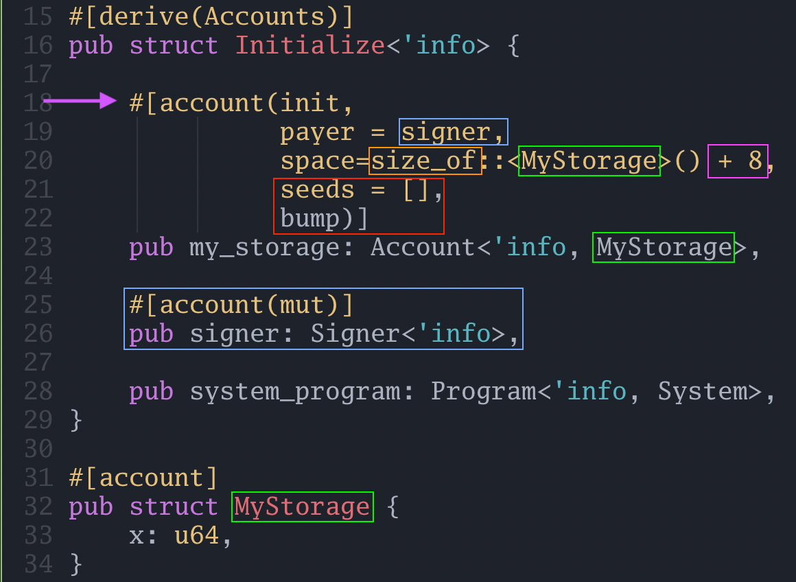

[Initializing Accounts in Solana and Anchor](https://www.rareskills.io/post/solana-initialize-account)


# Initializing Accounts in Solana and Anchor


Up until this point, none of our tutorials have used **“storage variables”** or stored anything permanent.

- In Solidity and **Ethereum**, a more exotic design pattern to store data is `SSTORE2` or `SSTORE3` where the data is stored in the bytecode of another smart contract.
- In **Solana**, this is not an exotic design pattern, it is the norm!

Recall that we can update the bytecode of a Solana program (*if we are the original deployer*) at will unless the program is marked as immutable.

Solana uses the same mechansim for data storage.

Storage slots in **Ethereum** are effectively a massive **key-value** store:

```json
{
    key: [smart_contract_address, storage slot]
    value: 32_byte_slot // (for example: 0x00)
}
```

**Solana**’s model is similar: it is a massive **key-value** store where:
- The **key** is a **base 58** encoded address.
- The **value** is a **data blob** that can be **up to 10MB** large (*or optionally hold nothing*).

It can be visualized as follows:

```json
{
    // key is a base58 encoded 32 byte sequence
    key: ETnqC8mvPRyUVXyXoph22EQ1GS5sTs1zndkn5eGMYWfs
    value: {
        data: 020000006ad1897139ac2bdb67a3c66a...
        // other fields are omitted
    }
}
```

**In Ethereum** :
- The bytecode of a smart contract and the storage variables of a smart contract are **stored separately**.
- They are **indexed differently** and must be loaded using different APIs.

The following diagram shows how Ethereum maintains state. Each account is a leaf in a Merkle tree. Note that the **“storage variables”** are stored **“inside”** the account of the smart contract (**Account 1**).


**In Solana** :
- Everything is an account that can potentially hold data.
- Sometimes we refer to one account as a **“program account”** or another account as a **“storage account”**.
- But the only difference is whether the **exectuable flag** is set to true and how we intend to use the data field of the account.

Below, we can see **Solana storage** is a **giant key-value store** from Solana **addresses to an account**:


Imagine if Ethereum had no storage variables and smart contracts were mutable by default. To store data, you had to create other **“smart contracts”** and keep the data in their bytecode, then modify it when necessary. This is one mental model of Solana.

Another mental model for this is how **everything is a file in Unix**, just some files are executable. Solana accounts can be thought of as files. They hold content, but they also have metadata that indicates who owns the file, if it is executable, and so forth.

- **In Ethereum**, storage variables are directly coupled to the smart contract. Unless a smart contract grants write or read access via public variables, delegatecall, or some setter method, by default, a storage variable can only be written to or read by a single contract (though anyone can read the storage variables off chain).
- **In Solana**, all “storage variables” can be read by any program, but only its owner program can write to it.

The way storage is “tied to” a program is via the **`owner` field**.

In the image below :
- We see the **account B** is **owned** by the **program account A**.
- We know **A is a program account** because *“executable”* is set to **true**.
- This indicates that the **`Data` field of B** will be storing **data for A**


## Solana programs need to be initialized before they can be used

- In **Ethereum**, we can directly write to a storage variable that we haven’t used before.
- However, **Solana** programs need an **explicit initialization** transaction. That is, we have to create the account before we can write data to it.

> It is possible to initialize and write to a Solana account in one transaction — however this introduces security issues which will complicate the discussion if we deal with them now. For now, it suffices to say that Solana accounts must be initialized before they can be used.


## A basic storage example

Let’s translate the following Solidity code to Solana:

```solidity
contract BasicStorage {
    Struct MyStorage {
        uint64 x;
    }

    MyStorage public myStorage;

    function set(uint64 _x) external {
        myStorage.x = _x;
    }
}
```

It may seem strange that we wrapped a single variable in a struct.

But in Solana programs, particularly Anchor, **all storage, or rather account data, is treated as a struct**. The reason is due to the flexibility of the account data. Since accounts are data blobs which can be quite large (*up to 10MB*), we need some *“structure”* to interpret the data, otherwise it is just a sequence of bytes with no meaning.

Behind the scenes, Anchor deserializes and serializes account data into structs when we try to read or write the data.

As mentioned above, we need to initialize the Solana account before we can use it, so before we implement the **`set()` function**, we need to write the **`initialize()` function**.


## Account initialization boilerplate code

Let’s create a **new Anchor project** called `basic_storage`.

```bash
anchor init basic_storage
cd basic_storage
anchor build
cargo update -p solana-program@1.18.3 --precise 1.17.4
anchor build
cargo update -p ahash@0.8.9 --precise 0.8.6
anchor build
ls -la
```

Below we have written the minimal code to initialize a `MyStorage` struct, which only holds one number, `x`. (*See the struct `MyStorage` at the bottom of the code*):

```rust
use anchor_lang::prelude::*;
use std::mem::size_of;

declare_id!("GLKUcCtHx6nkuDLTz5TNFrR4tt4wDNuk24Aid2GrDLC6");

#[program]
pub mod basic_storage {
    use super::*;

    pub fn initialize(ctx: Context<Initialize>) -> Result<()> {
        Ok(())
    }
}

#[derive(Accounts)]
pub struct Initialize<'info> {

    #[account(init,
              payer = signer,
              space=size_of::<MyStorage>() + 8,
              seeds = [],
              bump)]
    pub my_storage: Account<'info, MyStorage>,
    
    #[account(mut)]
    pub signer: Signer<'info>,

    pub system_program: Program<'info, System>,
}

#[account]
pub struct MyStorage {
    x: u64,
}
```


### 1) The initialize function

Note that there is no code in the **`initialize()` function** — in fact all it does is return `Ok(())`:

```rust
pub fn initialize(ctx: Context<Initialize>) -> Result<()> {
	Ok(())
}
```

It is not mandatory that functions for initializing accounts be empty, we could have custom logic. But for our example, it is empty. It is also not mandatory that functions which **initialize accounts** be called `initialize`, but it is a helpful name.


### 2) The Initialize struct

The `Initialize` Struct contains references to the resources needed to initialize an account:
- `my_storage`: a struct of type `MyStorage` we are initializing.
- `signer`: the **wallet that is paying for** the “gas” for storage of the struct. (*Gas costs for storage are discussed later*).
- `system_program`: we will discuss it later in this tutorial.


The **`'info` keyword** is a [**Rust lifetime**](https://doc.rust-lang.org/rust-by-example/scope/lifetime.html). That is a large topic and is best treated as boilerplate for now.

We will focus on the macro above `my_storage`, as this is where the action for initialization is happening.


### 3) The my_storage field in the Initialize struct

The attribute macro above the **`my_storage` field** *(**purple** arrow)* is how Anchor knows this transaction is intended to initialize this account (*remember, an [**attribute-like macro**](https://www.rareskills.io/post/rust-attribute-derive-macro) starts with `#` and modify augments the struct with additional functionality*) :



The **important keyword** here is `init`.

When we init an account, we must supply additional information:
- `payer` (**blue** box): who is **paying** the SOL **for allocating storage**. The signer is specified to be `mut` because their **account balance will change**, i.e. some SOL will be deducted from their account. Therefore, we annotate their account as “mutable.”
- `space` (**orange** box): this indicates **how much space** the account will take. Rather than figuring this out ourselves, we can use the **`std::mem::size_of` utility** and use the struct we are trying to store: `MyStorage` (**green** box), as an argument. The `+ 8` (**pink** box) we discuss in the following point.
- `seeds` and `bump` (**red** box): A program can own multiple accounts, it “discriminates” among the accounts with the “seed” which is used in calculating a “discriminator”. The **“discriminator” takes up 8 bytes**, which is why we need to allocate the additional 8 bytes in addition to the space our struct takes up. *The bump can be treated as boilerplate for now*.

This might seem like a lot to take in, don’t worry. **Initializing an account can largely be treated as boilerplate for now**.


### 4) What is the system program?

The `system_program` is a program built into the Solana runtime (*a bit like an [**Ethereum precompile**](https://www.rareskills.io/post/solidity-precompiles)*) that transfers SOL from one account to another. We will revisit this in a later tutorial about transferring SOL. For now, we need to transfer SOL away from the signer, who is paying for the **`MyStruct` storage**, so the `system_program` is always a part of initialization transactions.


### 5) MyStorage struct

Recall the data field inside the Solana account:


Under the hood, this is a byte sequence. The struct in the example above:

```rust
#[account]
pub struct MyStorage {
    x: u64,
}
```

gets serialized into a byte sequence and stored in the **`data` field** when written to. During write, the **`data` field** is deseriealized according to that struct.

In our example, we are only using one variable in the struct, though we could add more, or variables of another type, if we wanted to.
- The Solana runtime does not force us to use structs to store data. From Solana’s perspective, the account just holds a data blob.
- However, Rust has a lot of convenient libraries for turning structs into data blobs and vice versa, so structs are the convention.
- Anchor is leveraging these libraries behind the scenes.
- You are not required to use structs to use Solana accounts. It is possible to write sequence of bytes directly, but this is not a convenient way to store data.

The **`#[account]` macro** implements all the magic transparently.


### 6) Unit test initialization

The following Typescript code will run the Rust code above.

```javascript
import * as anchor from "@coral-xyz/anchor";
import { Program } from "@coral-xyz/anchor";
import { BasicStorage } from "../target/types/basic_storage";

describe("basic_storage", () => {
  anchor.setProvider(anchor.AnchorProvider.env());

  const program = anchor.workspace.BasicStorage as Program<BasicStorage>;

  it("Is initialized!", async () => {
    const seeds = []
    const [myStorage, _bump] = anchor.web3.PublicKey.findProgramAddressSync(seeds, program.programId);

    console.log("the storage account address is", myStorage.toBase58());

    await program.methods.initialize().accounts({ myStorage: myStorage }).rpc();
  });
});
```
- `anchor test --skip-local-validator`
- `solana-test-validator` (in another terminal)
- `solana logs` (in another terminal)

Here is the output of the unit test:


We will learn more about this in a following tutorial, but Solana requires us to specify in advance the accounts a transaction will interact with. Since we are interacting with the account that stores `MyStruct`, we need to compute its “address” in advance and pass it to the **`initialize()` function**. This is done with the following Typescript code:

```javascript
seeds = []
const [myStorage, _bump] = anchor.web3.PublicKey.findProgramAddressSync(seeds, program.programId);
```

Note that `seeds` is an empty array, just like it is in the Anchor program.


### Predicting the account address in Solana is like create2 in Ethereum

In **Ethereum**, the address of a contract created using `create2` is dependent on:
- The **address** of the deploying contract.
- A **salt**.
- And the **bytecode** of the created contract.

Predicting the address of initialized accounts in **Solana** is very similar except that **it ignores the “bytecode”**. Specifically, it depends on:
- The program that owns the storage account, `basic_storage` (*which is akin to the address of the deploying contract*)
- And the `seeds` (*which is akin to `create2`’s “salt”*)

In all the examples in this tutorial, `seeds` is an empty array, but we will explore non-empty arrays in a later tutorial.


### Don’t forget to convert my_storage to myStorage

Anchor silently convert’s Rust **snake case** to Typescript’s **camel case**. When we supply `.accounts({myStorage: myStorage})` in Typescript to the **`initialize` function**, it is “filling out” the `my_storage` **key** in the **`Initialize` struct** in Rust (**green** circle below). The `system_program` and `Signer` are quietly filled in by Anchor:


## Accounts cannot be initialized twice

If we could reinitialize an account, that would be highly problematic since a user could wipe data from the system! Thankfully, Anchor defends against this in the background.

If you run the test a second time (*without reseting the local validator*), you will get the error screenshotted below.

Alternatively, you can run the following test if you aren’t using the local validator:

```javascript
import * as anchor from "@coral-xyz/anchor";
import { Program } from "@coral-xyz/anchor";
import { BasicStorage} from "../target/types/basic_storage";

describe("basic_storage", () => {
  anchor.setProvider(anchor.AnchorProvider.env());

  const program = anchor.workspace.BasicStorage as Program<BasicStorage>;

  it("Is initialized!", async () => {
    const seeds = []
    const [myStorage, _bump] = anchor.web3.PublicKey.findProgramAddressSync(seeds, program.programId);
 
    // ********************************************
    // **** NOTE THAT WE CALL INITIALIZE TWICE ****
    // ********************************************
    await program.methods.initialize().accounts({myStorage: myStorage}).rpc();
    await program.methods.initialize().accounts({myStorage: myStorage}).rpc();
  });
});
```

When we run the test, the test fails because the second call to `initialize` throws an error. The expected output is as follows:


## Don’t forget to reset the validator if running the test multiple times

Because the `solana-test-validator` will still remember the account from the first unit test, you’ll want to reset the validator between tests using `solana-test-validator --reset`. Otherwise, you’ll get the error above.


## Summary of initializing accounts

The need to initialize an account will likely feel unnatural to most EVM developers.

Don’t worry, you’ll see this code sequence over and over again, and it will become second nature after a while.

We’ve only looked at initializing storage in this tutorial, in the upcoming ones we will study reading, writing, and deleting storage. There will be plenty of opportunities to get an intuitive grasp for what all the code we looked at today does.

**Exercise**: modify `MyStorage` to hold `x` and `y` as if it were a cartesian coordinate. This means adding `y` to the **`MyStorage` struct** and changing them from `u64` to `i64`. You will not need to modify other parts of the code because `size_of` will recalculate the size for you. Be sure to reset the validator so that the original storage account gets erased and you aren’t blocked from initializing the account again.    