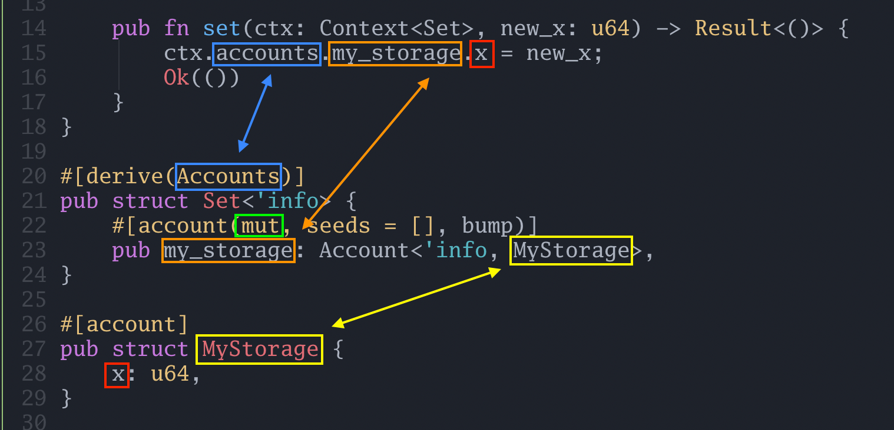
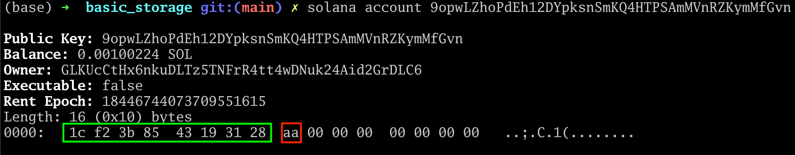

[Solana counter tutorial: reading and writing data to accounts](https://www.rareskills.io/post/solana-counter-program)

# Solana counter tutorial: reading and writing data to accounts


In our previous tutorial, we discussed how to initialize an account so that we could persist data in storage. This tutorial shows how to write to an account we have already initialized.

```bash
anchor init read_write_storage
cd read_write_storage
anchor build
cargo update -p solana-program@1.18.3 --precise 1.17.4
anchor build
cargo update -p ahash@0.8.9 --precise 0.8.6
anchor build
ls -la
```

Below is the code from the previous tutorial on initializing Solana accounts. We have added a **`set()` function** to store a number in `MyStorage` and the associated **`Set` struct**.

The rest of the code is unchanged:

```rust
use anchor_lang::prelude::*;
use std::mem::size_of;

declare_id!("GLKUcCtHx6nkuDLTz5TNFrR4tt4wDNuk24Aid2GrDLC6");

#[program]
pub mod basic_storage {
    use super::*;

    pub fn initialize(ctx: Context<Initialize>) -> Result<()> {
        Ok(())
    }

    // ****************************
    // *** THIS FUNCTION IS NEW ***
    // ****************************
    pub fn set(ctx: Context<Set>, new_x: u64) -> Result<()> {
        ctx.accounts.my_storage.x = new_x;
        Ok(())
    }
}

// **************************
// *** THIS STRUCT IS NEW ***
// **************************
#[derive(Accounts)]
pub struct Set<'info> {
    #[account(mut, seeds = [], bump)]
    pub my_storage: Account<'info, MyStorage>,
}

#[derive(Accounts)]
pub struct Initialize<'info> {
    #[account(init,
              payer = signer,
              space=size_of::<MyStorage>() + 8,
              seeds = [],
              bump)]
    pub my_storage: Account<'info, MyStorage>,

    #[account(mut)]
    pub signer: Signer<'info>,

    pub system_program: Program<'info, System>,
}

#[account]
pub struct MyStorage {
    x: u64,
}
```

The following is our Typescript test code. The only change from the previous code is the addition of the call to the **`set()` function** at the end. Note that we are passing the number **170** to `set()`. This is the value for `x` in `MyStorage` that we are trying to persist:


## The set() function explained

Below, we have slightly reordered the code to show the **`set()` function**, the **`Set` struct**, and the **`MyStorage` struct** close together:



We now explain how `ctx.accounts.my_storage.x = new_x` works:
- The **`accounts` field** (**top blue box**) in `ctx` gives us access to all the keys in the **`Set` struct**. This is not how you list the keys of a struct in Rust. accounts ability to refer to keys in the Set struct is magically inserted due to the **`#[derive(Accounts)]` macro** (**lower blue box**).
- The **account `my_storage`** (**orange** box) is set to be `mut` or mutable (**green** box) because we intend to change a value in it, `x` (**red** box)
- The **key `my_storage`** (**orange** box) give us a reference to the **`MyStorage` account** (**yellow** box) by passing `MyStorage` as a generics parameter to `Account`. The fact that we used a **key `my_storage`** and a storage **struct `MyStorage`** is for readability, they don’t need to be camel-cased variations of each other. What “ties them together” is illustrated with the yellow boxes and yellow arrow.

Essentially, when `set()` is called, the caller (*Typescript client*) passes the **`myStorage` account** to `set()`. Inside this account is the address of the storage. Behind the scenes, set will load the storage, write the new value of `x`, serialize the struct, then store it back.


## The Context struct Set

The **`Context` struct** for `set()` is considerably simpler than `initialize()` because it only needs one resource: a mutable reference to the MyStorage account.

```rust
#[derive(Accounts)]
pub struct Set<'info> {
    #[account(mut, seeds = [], bump)]
    pub my_storage: Account<'info, MyStorage>,
}
```

Recall, a **Solana transaction must specify in advance which accounts it will access**. The struct for the **`set()` function** specifies it will be **mutably** (`mut`) accessing the **`my_storage` account**.

The `seeds = []` and `bump` are used to derive the address of the account we will be modifying. Although the user is passing in the account for us, Anchor validates that the user is passing an account this program really owns by re-deriving the address and comparing it to what the user provided.

**The term `bump`** can be treated as boilerplate for now. But for the curious, it is used to ensure that the account is not a cryptographically valid public key. This is how the runtime knows this will be used as data storage for programs.

Even though our Solana program could derive the address of the storage account on its own, the user still needs to provide the **account `MyStorage`** anyway. This is required by the Solana runtime for reasons we will discuss in an upcoming tutorial.


## An alternative way to write the set function

If we were writing several variables to the account, it would be rather clumsy to keep writing `ctx.accounts.my_storage` over and over like so:

```rust
ctx.accounts.my_storage.x = new_x;
ctx.accounts.my_storage.y = new_y;
ctx.accounts.my_storage.z = new_z;
```

Instead, we can use a **“mutable reference”** (`&mut`) from Rust that gives us a “handle” on the value for us to manipulate. Consider the following rewrite of our **`set()` function**:

```rust
pub fn set(ctx: Context<Set>, new_x: u64) -> Result<()> {
    let my_storage = &mut ctx.accounts.my_storage;
    my_storage.x = new_x;

    Ok(())
}
```

**Exercise**: Rerun the tests with the new set function.
> Don’t forget to **reset** the validator if you are using a **local testnet**.

- `anchor test --skip-local-validator`
- `solana-test-validator --reset` (in another terminal)
- `solana logs` (in another terminal)


## Viewing our storage account

If you are running a local validator for the tests, you can view the account data with the following Solana command line instruction:

```bash
# replace the address with the one in your test
solana account 9opwLZhoPdEh12DYpksnSmKQ4HTPSAmMVnRZKymMfGvn
```

> Replace the address with the one console logged from the unit tests.

The output is as follows:



- The **first 8 bytes** (**green** box) are the **discriminator**.
- Our test stored the number **170** in the struct, this has a **hex** representation of **aa** which is shown in the **red** box.

```bash
solana account 4ob5tvgYWr9MeTtHZS3yCfyQyxNXJ96Gmkx9JWAEUMEy
```
```
Public Key: 4ob5tvgYWr9MeTtHZS3yCfyQyxNXJ96Gmkx9JWAEUMEy
Balance: 0.00100224 SOL
Owner: 6AHTMuew9aNk4RWEaYNJ18mBEeVrrDaiwwpcGgLqui3o
Executable: false
Rent Epoch: 18446744073709551615
Length: 16 (0x10) bytes
0000:   1c f2 3b 85  43 19 31 28  00 00 00 00  00 00 00 00   ..;.C.1(........
```
Of course, the command line is not the mechanism we want to use to view account data on the frontend, or if we want our program to view another program’s account. This will be discussed in the following tutorial.

```
Length: 16 (0x10) bytes
0000:   1c f2 3b 85  43 19 31 28  09 03 00 00  00 00 00 00   ..;.C.1(........
```

**777 (decimal)** **0X0309 (hex)** **09 03 00 00**


## Viewing our storage account from within the Rust Program

Reading our own storage value inside the Rust program however, is straightforward.

We add the following function to `pub mod basic_storage`:

```rust
pub fn print_x(ctx: Context<PrintX>) -> Result<()> {
    let x = ctx.accounts.my_storage.x;
    msg!("The value of x is {}", x);
    Ok(())
}
```

and then we add the following struct for `PrintX`

```rust
#[derive(Accounts)]
pub struct PrintX<'info> {
    pub my_storage: Account<'info, MyStorage>,
}
```

Note that `my_storage` does not have the **`#[account(mut)]` macro** because we don’t need it to be mutable, we are just reading it.

We then add the following line to our test:

```javascript
await program.methods.printX().accounts({myStorage: myStorage}).rpc();
```

If you are running the `solana logs` in the background, you should see the number get printed.

**Exercise**: Write an increment function that reads `x` and stores `x + 1` back in `x`.