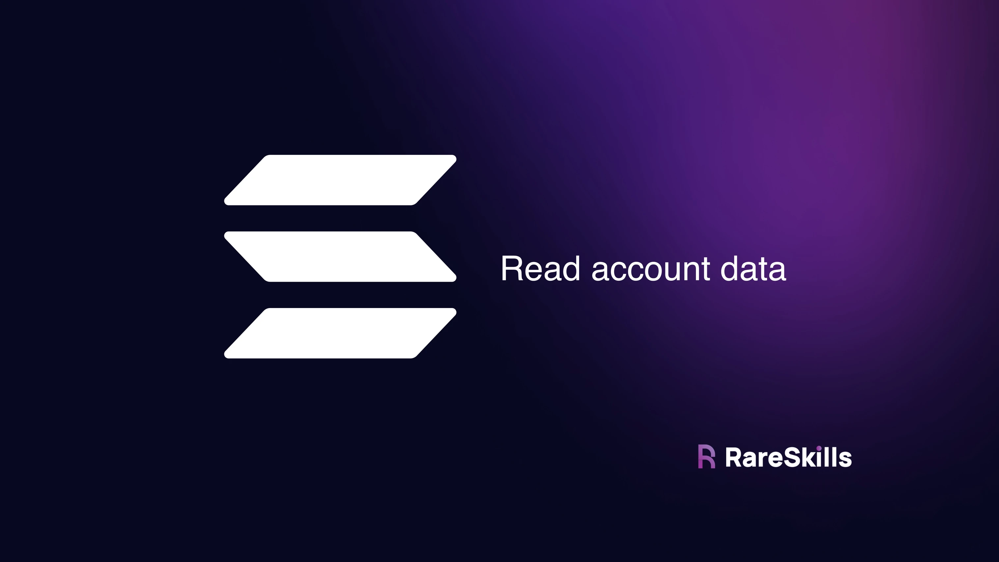
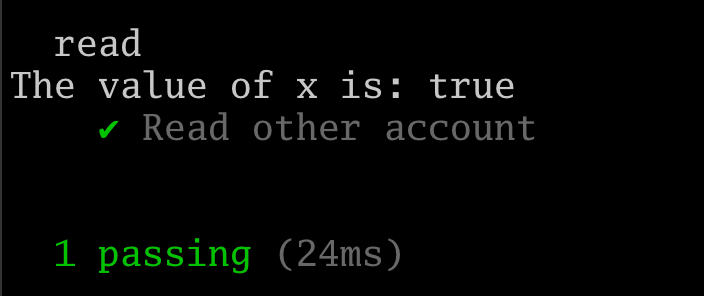
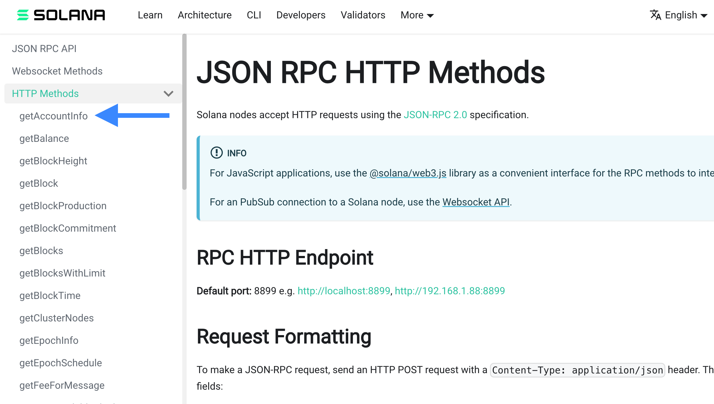
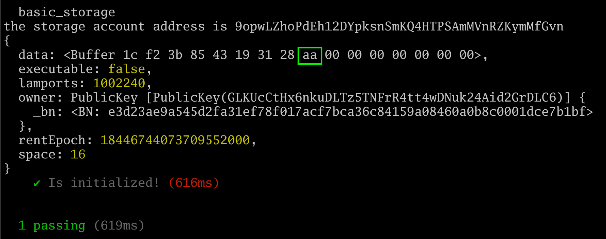

[Read account data with Solana web3 js and Anchor](https://www.rareskills.io/post/solana-read-account-data)

# Read account data with Solana web3 js and Anchor



> This tutorial shows how to read account data directly from the Solana web3 Javascript client so that a web app could read it on the frontend.

In the previous tutorial we used solana `account <account address>` to read the data we wrote, but this won’t work if we are building a dApp on a website.

Instead, we must calculate the address of the storage account, read the data, and deserialize the data from the Solana web3 client.

Imagine in Ethereum we wanted to avoid using public variables or view functions, but still wanted to show their values on the frontend. To view the value in storage variables without making them public or adding a view function, we would instead use the **`getStorageAt(contract_address, slot)` API**. We are going to do something similar in Solana, except that instead of passing in the **`(contract_address, slot)` pair**, we just pass in the address of the program and derive the address of its storage account(s).

Here is the Rust code from the previous tutorial. It initializes `MyStorage` and writes to `x` using the **`set()` function**. We will not modify it in this tutorial:

```rust
use anchor_lang::prelude::*;
use std::mem::size_of;

declare_id!("GLKUcCtHx6nkuDLTz5TNFrR4tt4wDNuk24Aid2GrDLC6");

#[program]
pub mod basic_storage {
    use super::*;

    pub fn initialize(ctx: Context<Initialize>) -> Result<()> {
        Ok(())
    }

    pub fn set(ctx: Context<Set>, new_x: u64) -> Result<()> {
        ctx.accounts.my_storage.x = new_x;
        Ok(())
    }
}

#[derive(Accounts)]
pub struct Set<'info> {
    #[account(mut, seeds = [], bump)]
    pub my_storage: Account<'info, MyStorage>,
}

#[derive(Accounts)]
pub struct Initialize<'info> {

    #[account(init,
              payer = signer,
              space=size_of::<MyStorage>() + 8,
              seeds = [],
              bump)]
    pub my_storage: Account<'info, MyStorage>,
    
    #[account(mut)]
    pub signer: Signer<'info>,

    pub system_program: Program<'info, System>,
}

#[account]
pub struct MyStorage {
    x: u64,
}
```

The following is the Typescript unit test that:

1. Initializes the account
2. Writes **170** to storage
3. Reads the value back using the **`fetch()` function**:

```javascript
import * as anchor from "@coral-xyz/anchor";
import { Program } from "@coral-xyz/anchor";
import { BasicStorage} from "../target/types/basic_storage";

describe("basic_storage", () => {
  anchor.setProvider(anchor.AnchorProvider.env());

  const program = anchor.workspace.BasicStorage as Program<BasicStorage>;

  it("Is initialized!", async () => {
    const seeds = []
    const [myStorage, _bump] = anchor.web3.PublicKey.findProgramAddressSync(seeds, program.programId);

    console.log("the storage account address is", myStorage.toBase58());
 
    await program.methods.initialize().accounts({myStorage: myStorage}).rpc();
    await program.methods.set(new anchor.BN(170)).accounts({myStorage: myStorage}).rpc();
  
    // ***********************************
    // *** NEW CODE TO READ THE STRUCT ***
    // ***********************************
    let myStorageStruct = await program.account.myStorage.fetch(myStorage);
    console.log("The value of x is:",myStorageStruct.x.toString());
    });
});
```

Viewing an account in Anchor can be done with:

```javascript
let myStorageStruct = await program.account.myStorage.fetch(myStorage); console.log("The value of x is:", myStorageStruct.x.toString());
```

Anchor is automatically calculating the address of the **`MyStorage` account**, reading it in, and formatting it as a Typescript object.

To understand how Anchor is magically converting the **Rust struct into a Typescript struct**, let’s take a look at the **IDL** in `target/idl/basic_storage.json`. Towards the bottom of the JSON, we can see a definition of the struct our program is creating:

**Extrait** :
```json
"accounts": [
  {
    "name": "MyStorage",
    "type": {
      "kind": "struct",
      "fields": [
        {
          "name": "x",
          "type": "u64"
        }
      ]
    }
  }
]
```
```rust
#[account]
pub struct MyStorage {
    x: u64,
}
```

> This method only works for accounts your program or client initialized or created and have the IDL for, it **will not work for an arbitrary account**.

That is, if you pick a random account on Solana and use the code above, the deserialization will almost certainly fail. Later in this article we will read the account in a more “raw” manner.

The **function `fetch()`** is not magical. So how do we do this for an account we did not create?


## Fetching data from accounts created by Anchor Solana programs

If we know the IDL of another program that was created with Anchor, we can conveniently read its account data.

Let’s `anchor init` another program in another shell, then have it initialize an account, and then set a single boolean variable in that struct to `true`. We’ll call this other **account `other_program`** and the **struct** that stores its boolean as `TrueOrFalse`:

```bash
anchor init day_18_other_program
cd day_18_other_program
anchor build
cargo update -p solana-program@1.18.3 --precise 1.17.4
anchor build
cargo update -p ahash@0.8.9 --precise 0.8.6
anchor build
ls -la
```


```rust
use anchor_lang::prelude::*;
use std::mem::size_of;

declare_id!("4z4dduMSFKFJDnUAKaHnbhHySK8x1PwgArUBXzksjwa8");

#[program]
pub mod other_program {
    use super::*;

    pub fn initialize(ctx: Context<Initialize>) -> Result<()> {
        Ok(())
    }

    pub fn setbool(ctx: Context<SetFlag>, flag: bool) -> Result<()> {
        ctx.accounts.true_or_false.flag = flag;
        Ok(())
    }
}

#[derive(Accounts)]
pub struct Initialize<'info> {
    #[account(mut)]
    signer: Signer<'info>,

    system_program: Program<'info, System>,

    #[account(init, payer = signer, space = size_of::<TrueOrFalse>() + 8, seeds=[], bump)]
    true_or_false: Account<'info, TrueOrFalse>,
}

#[derive(Accounts)]
pub struct SetFlag<'info> {
    #[account(mut)]
    true_or_false: Account<'info, TrueOrFalse>, 
}

#[account]
pub struct TrueOrFalse {
    flag: bool,
}
```

Typescript code:

```typescript
import * as anchor from "@coral-xyz/anchor";
import { Program } from "@coral-xyz/anchor";
import { OtherProgram } from "../target/types/other_program";

describe("other_program", () => {
  anchor.setProvider(anchor.AnchorProvider.env());

  const program = anchor.workspace.OtherProgram as Program<OtherProgram>;

  it("Is initialized!", async () => {
    const seeds = []
    const [TrueOrFalse, _bump] = anchor.web3.PublicKey.findProgramAddressSync(seeds, program.programId);

    console.log("address: ", program.programId.toBase58());

    await program.methods.initialize().accounts({trueOrFalse: TrueOrFalse}).rpc();
    await program.methods.setbool(true).accounts({trueOrFalse: TrueOrFalse}).rpc();
  });
});
```

- `anchor test --skip-local-validator`
- `solana-test-validator --reset` (in another terminal)
- `solana logs` (in another terminal)

Run the tests in another shell against a local validator. Take note of the `programId` that gets printed out. We will need it to derive the address of `other_program`’s **account**.

```
  day_18_other_program
address:  8H6Ag2w2ipTuNyUi4dvKk3zPd4MYg3HCiUiBgmaC5NA2
    ✔ Is initialized! (705ms)
```


### read program

In another shell, `anchor init` another program. We’ll call it `read`. We are only going to use the Typescript code to read the **`TrueOrFalse` struct** of `other_program`, no Rust is used. This simulates reading from another program’s storage account.

```bash
anchor init day_18_read
cd day_18_read
anchor build
cargo update -p solana-program@1.18.3 --precise 1.17.4
anchor build
cargo update -p ahash@0.8.9 --precise 0.8.6
anchor build
ls -la
```

The layout of our directory is as follows:

```
parent_dir/
  ∟ other_program/
  ∟ read/
```

The following code will read the **`TrueOrFalse` struct** from `other_program`. Ensure that :
- The `otherProgramAddress` matches the one from printed above.
- Ensure that you are reading the **`other_program.json` IDL** from the right file location.
- Make sure to **run the tests** with `anchor test --skip-local-validator` to ensure that this code reads the account the other program created.

```typescript
import * as anchor from "@coral-xyz/anchor";

describe("read", () => {
  anchor.setProvider(anchor.AnchorProvider.env());

  it("Read other account", async () => {
    // the other program's programdId -- make sure the address is correct
    const otherProgramAddress = "4z4dduMSFKFJDnUAKaHnbhHySK8x1PwgArUBXzksjwa8";
    const otherProgramId = new anchor.web3.PublicKey(otherProgramAddress);

    // load the other program's idl -- make sure the path is correct
    const otherIdl = JSON.parse(
        require("fs").readFileSync("../other_program/target/idl/other_program.json", "utf8")
    );
    
    const otherProgram = new anchor.Program(otherIdl, otherProgramId);

    const seeds = []
    const [trueOrFalseAcc, _bump] = 
	    anchor.web3.PublicKey.findProgramAddressSync(seeds, otherProgramId);
    let otherStorageStruct = await otherProgram.account.trueOrFalse.fetch(trueOrFalseAcc);

    console.log("The value of flag is:", otherStorageStruct.flag.toString());
  });
});
```

The expected output is as follows:




```bash
  day_18_read
The value of flag is: true
    ✔ Read other account (52ms)


  1 passing (55ms)
```

Again, this only works if the other Solana program was built with Anchor. This is relying on how Anchor serializes structs.


## Fetching the data for an arbitrary account

In the following section we show how to read data without the Anchor magic.

Unfortunately, the documentation for Solana’s Typescript client is very limited and the library has been updated enough times to deprecate tutorials on the subject.

Your best bet for trying to find the Solana web3 Typescript function you need is to look at the [**HTTP JSON RPC Methods**](https://docs.solana.com/api/http) and look for one that seems promising. In our case, [**`getAccountInfo`**](https://solana.com/docs/rpc/http/getaccountinfo) looks promising (**blue arrow**).



Next we want to try to find that method in Solana web3 js. Preferably, you should use an IDE with autocompletion so you can fiddle around until you find that function as the following video demonstrates:

[**VIDEO**](https://video.wixstatic.com/video/935a00_06ca67880d9f4b1b8415cd580faf0ea6/480p/mp4/file.mp4)

```javascript
let myStorageInfo = await anchor.getProvider().connection.getAccountInfo(myStorage);
console.log(myStorageInfo);
```

Below we show the expected output of running the test again:



The **green box** around the **hex `aa` byte** shows we have successfully retrieved the **decimal 170** value we stored in the **`set()` function**.

The next step is to parse the data buffer, which is not something we will cover here.

> The reader should be warned that deserializing this data may be a frustrating process.

**There is no “enforced” way that data is serialized in a Solana account**. Anchor serializes structs its own way, but if someone wrote a Solana program in raw Rust (*without Anchor*) or used their own serialization algorithm, then you will have to customize your deserialization algorithm for how they serialized the data.