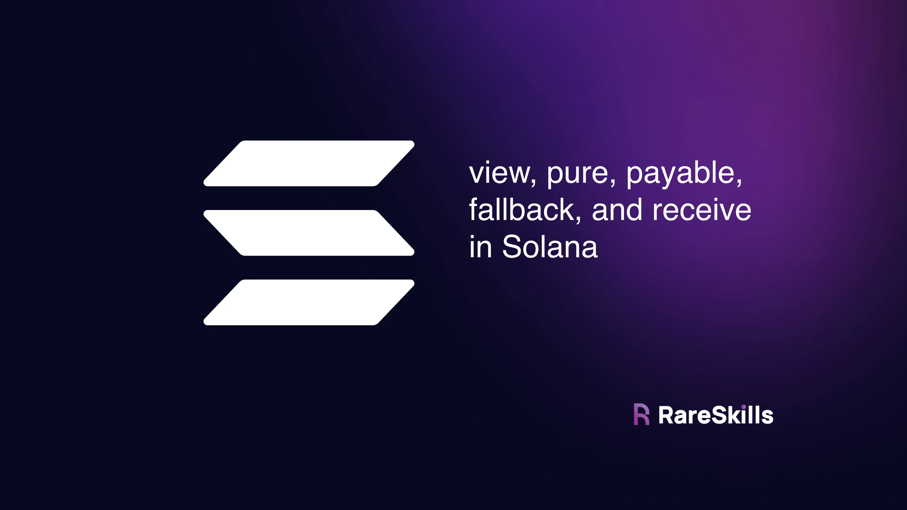

[Function modifiers (view, pure, payable) and fallback functions in Solana: why they don't exist](https://www.rareskills.io/post/solidity-function-types-solana)

# Function modifiers (view, pure, payable) and fallback functions in Solana: why they don't exist

## Solana does not have fallback or receive functions

A Solana transaction must specify in advance the accounts it will modify or read as part of a transaction. If a **“fallback” function** accesses an indeterminant account, then the entire transaction will fail. This would put an onus (*french : "fardeau, charge"*) on the user to anticipate the accounts the fallback function will access. It’s much simpler as a result to simply disallow these kinds of functions.

## Solana does not have a notion of a “view” or “pure” function

A **`view` function** in Solidity creates a guarantee that the state will not change using two mechanisms:

- All external calls in a view function are [**staticcalls**](https://www.rareskills.io/post/solidity-staticcall) (*calls that revert if a state change happens*).
- If the compiler detects **state-changing opcodes**, it throws an error.

A **`pure` function** takes this even further by the compiler checking if there are opcodes that view the state.

These function restrictions happen mostly at the compiler level, and Anchor does not implement any of these compiler checks. Anchor is not the only framework for building Solana programs. [**Seahorse**](https://seahorse-lang.org) is another one. Perhaps some other framework will come along with function annotations explicitly stating what functions can and cannot do, but for now we can rely on the following guarantee:

> If an account is not included in the **`Context` struct** definition, that function won’t access that account.

This does *not* mean that the account cannot be accessed at all. For example, we could craft a separate program to read in an account and somehow forward that data to the function in question.

Finally, there is no such thing as a `staticcall` in the Solana Virtual Machine (SVM) or runtime.

## View functions aren’t necessary in Solana anyway

Because a Solana program can read any account passed to it, it can read an account owned by another program.

The program owning the account does not need to implement a view function to grant access for another program to view that account. The **`web3.js` client** — *or another program* — can [**view the Solana account data**](https://www.rareskills.io/post/solana-read-account-data) directly.

This has a very important implication:

> It is not possible to use reentrancy locks to directly defend against read only reentrancy in Solana. The program must expose flag for readers to know if the data is reliable.

[**Read only reentrancy**](https://www.rareskills.io/post/where-to-find-solidity-reentrancy-attacks) happens when a victim contract accesses a view function that is showing manipulated data. This can be defended against in Solidity by adding a nonReentrant modifier to the view function. However, in Solana there is no way to prevent another program from viewing data in an account.

However, Solana programs can still implement the flags reentrancy guards use. Programs consuming the account of another program can check those flags to see if the account might currently be in a reentrant state and should not be trusted.

## There are no custom modifiers in Rust

Custom **modifiers** like `onlyOwner` or `nonReentrant` are a Solidity construct, and not a feature available in Rust.

## Custom units are not available in Rust or Anchor

Because Solidity is intertwined (*french : "entrelacé"*) with Ethereum, it has handy keywords like **ethers** or **wei** to measure Ethereum. Not surprisingly, `LAMPORTS_PER_SOL` is not defined in Rust, but somewhat surprisingly, it is not defined in the Anchor Rust Framework either. It is available in the **Solana `web3.js` library** however.

Similarly, Solidity has `days` as a convenient **alias for 84,600 seconds**, but no such equivalent exists in Rust/Anchor.

## There is no such thing as “payable” functions in Solana. Programs transfer SOL from the user, users do not transfer SOL to the program

This is the subject of the next tutorial.