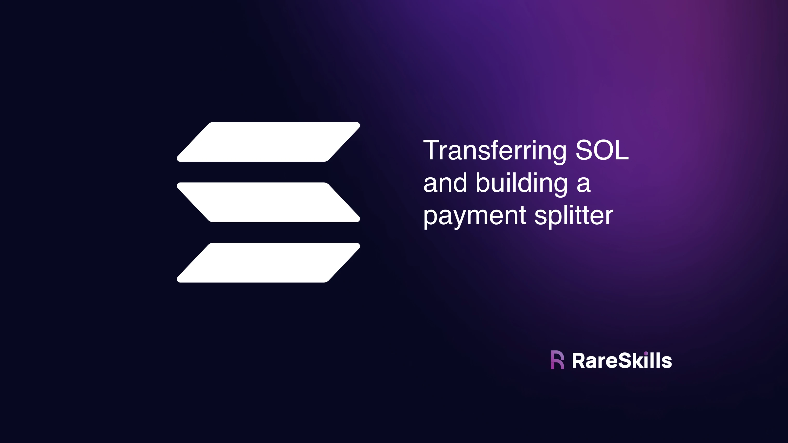
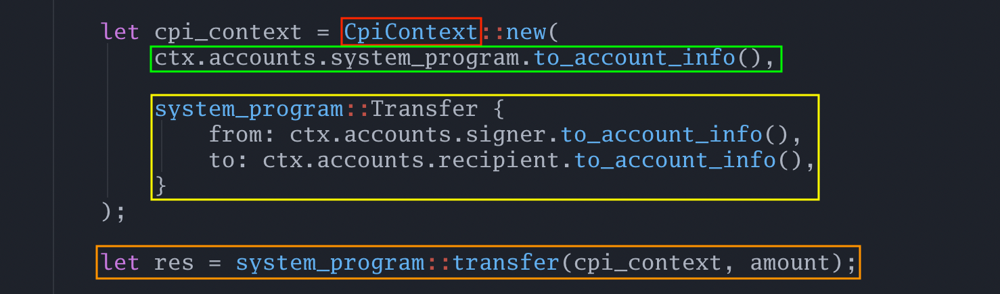
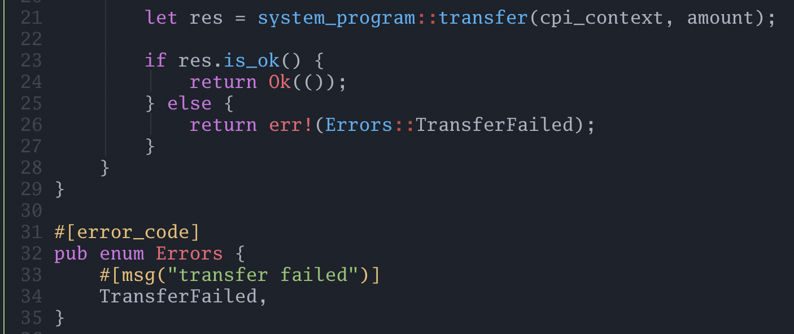
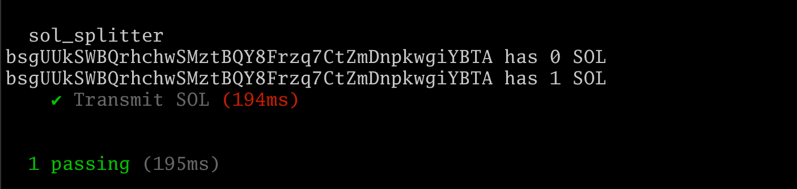
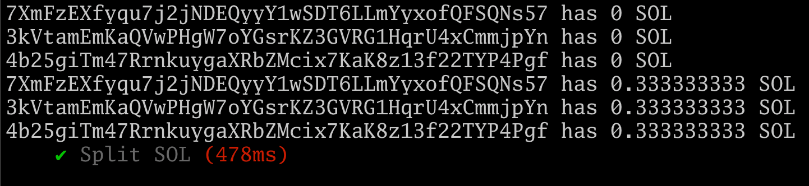

[Transferring SOL and building a payment splitter: "msg.value" in Solana](https://www.rareskills.io/post/anchor-transfer-sol)

# Transferring SOL and building a payment splitter: "msg.value" in Solana



This tutorial will introduce the mechanism by which Solana Anchor programs can transfer SOL as part of the transaction.

> Unlike Ethereum where wallets specify `msg.value` as part of the transaction and “push” the ETH to the contract, **Solana programs “pull” the Solana from the wallet**.

As such, there is no such thing as **`payable` functions** or `msg.value`.

Below we have created a **new anchor project** called `sol_splitter` and have put the Rust code to transfer SOL from the sender to a recipient.

```bash
anchi day_23_sol_splitter
cargo update -p solana-program@1.18.3 --precise 1.17.4
anchor build
cargo update -p ahash@0.8.10 --precise 0.8.6
anchor build
ls -la
```

Of course, it would be more efficient if the sender just sent the SOL directly rather than doing it through a program, but we want to illustrate how it is done:

```rust
use anchor_lang::prelude::*;
use anchor_lang::system_program;

declare_id!("9qnGx9FgLensJQy1hSB4b8TaRae6oWuNDveUrxoYatr7");

#[program]
pub mod sol_splitter {
    use super::*;

    pub fn send_sol(ctx: Context<SendSol>, amount: u64) -> Result<()> {

        let cpi_context = CpiContext::new(
            ctx.accounts.system_program.to_account_info(), 

            system_program::Transfer {
                from: ctx.accounts.signer.to_account_info(),
                to: ctx.accounts.recipient.to_account_info(),
            }
        );

        let res = system_program::transfer(cpi_context, amount);

        if res.is_ok() {
            return Ok(());
        } else {
            return err!(Errors::TransferFailed);
        }
    }
}

#[error_code]
pub enum Errors {
    #[msg("transfer failed")]
    TransferFailed,
}

#[derive(Accounts)]
pub struct SendSol<'info> {
    /// CHECK: we do not read or write the data of this account
    #[account(mut)]
    recipient: UncheckedAccount<'info>,
    
    system_program: Program<'info, System>,

    #[account(mut)]
    signer: Signer<'info>,
}
```

There are a lot of things to explain here.


## Introducing the CPI: Cross Program Invocation

**In Ethereum**, transferring ETH is done simply by specifying a value in the **`msg.value` field**. 

**In Solana**, a built-in program called the **`system_program`** transfers SOL from one account to another. That’s why it kept showing up when we initialized accounts and had to pay a fee to initialize them.

*"C'est pourquoi cela continuait à apparaître lorsque nous initialisions des comptes et que nous devions payer des frais pour les initialiser."*

- You can roughly think of the system program as a precompile in Ethereum.
- Imagine it behaves sort of like an ERC-20 token built into the protocol that is used as the native currency.
- And it has a public function called `transfer()`.


## Context for CPI transactions

Whenever a Solana program function is called, a `Context` must be provided. That Context holds all the accounts that the program will interact with.

Calling the system program is no different. The system program needs a `Context` holding **the `from` and `to` accounts**. The `amount` that is transferred is passed as a “regular” argument — it is not part of the `Context` (*as **`amount` is not an account**, it is just a value*).

We can now explain the code snippet below:



We are building a new `CpiContext` which holds what program we are going to call as the **first argument** (**green** box), and the accounts that will be included as part of that transaction (**yellow** box). The **argument `amount`** is not supplied here because amount is not an account.

Now that we have our `cpi_context` built, we can do a cross program invocation to the `system_program` (**orange** box) while specifying the amount.

This returns a **`Result<()>` type**, just like the public functions on our Anchor programs do.


## Do not ignore the return values of cross program invocations.

To check if the cross program **invocation succeeded**, we just need to check the returned value is an `Ok`. Rust makes this straightforward with the **`is_ok()` method**:




## Only the signer can be “from”

If you call the system program with `from` being an account that is **not a `Signer`**, then the system program will reject the call.

> Without a signature, the system program can’t know if you authorized the call or not.

Typescript code:

```typescript
import * as anchor from "@coral-xyz/anchor";
import { Program } from "@coral-xyz/anchor";
import { SolSplitter } from "../target/types/sol_splitter";

describe("sol_splitter", () => {
  // Configure the client to use the local cluster.
  anchor.setProvider(anchor.AnchorProvider.env());

  const program = anchor.workspace.SolSplitter as Program<SolSplitter>;

  async function printAccountBalance(account) {
    const balance = await anchor.getProvider().connection.getBalance(account);
    console.log(`${account} has ${balance / anchor.web3.LAMPORTS_PER_SOL} SOL`);
  }

  it("Transmit SOL", async () => {
    // generate a new wallet
    const recipient = anchor.web3.Keypair.generate();

    await printAccountBalance(recipient.publicKey);

    // send the account 1 SOL via the program
    let amount = new anchor.BN(1 * anchor.web3.LAMPORTS_PER_SOL);
    await program.methods.sendSol(amount)
      .accounts({recipient: recipient.publicKey})
      .rpc();

    await printAccountBalance(recipient.publicKey);
  });
});
```
- `anchor test --skip-local-validator`
- `solana-test-validator --reset` (in another terminal)
- `solana logs` (in another terminal)

Some items to note:

- We have created a helper function `printAccountBalance()` to show the balance **before and after**.
- We generated the recipient wallet using `anchor.web3.Keypair.generate()`.
- We transferred one SOL to the new account.

When we run the code, the expected result is as follows. The print statements are the balance before and after of the recipient’s address:



```bash
  day_23_sol_splitter
F6WxdvBCvZ4A1KLZkiEN6nb5eLS14NYdjRqECzjZ61Vf has 0 SOL
F6WxdvBCvZ4A1KLZkiEN6nb5eLS14NYdjRqECzjZ61Vf has 1 SOL
    ✔ Transmit SOL (430ms)


  1 passing (432ms)
```

**Exercise**: Build a Solana program that splits up the incoming SOL evenly among two recipients. You will not be able to accomplish this via function arguments, the accounts need to be in the Context struct.

```bash
  day_23_sol_splitter
59o4q7Sm9FLPigensW7Nvb9gM5TKsuHTkpzH4kXCiqdn has 0 SOL
9yTGyowXasTHC5Zm9cByYAnrS4XwJagKZSFLqdd2nRz4 has 0 SOL

59o4q7Sm9FLPigensW7Nvb9gM5TKsuHTkpzH4kXCiqdn has 0.5 SOL
9yTGyowXasTHC5Zm9cByYAnrS4XwJagKZSFLqdd2nRz4 has 0.5 SOL
    ✔ Transmit SOL (568ms)
```

Avant:
```bash
solana_rareskills on  main []
❯ solana balance
499999991.091703415 SOL
```
Après:
```bash
solana_rareskills on  main [] 
❯ solana balance
499999990.08986342 SOL
```
**1,001839995 SOL**


## Building a payment splitter: using an arbitrary number of accounts with remaining_accounts.

We can see it would be rather clumsy to have to specify a Context struct like if we wanted to split SOL among several accounts:

```rust
#[derive(Accounts)]
pub struct SendSol<'info> {
    /// CHECK: we do not read or write the data of this account
    #[account(mut)]
    recipient1: UncheckedAccount<'info>,

    /// CHECK: we do not read or write the data of this account
    #[account(mut)]
    recipient2: UncheckedAccount<'info>,

    /// CHECK: we do not read or write the data of this account
    #[account(mut)]
    recipient3: UncheckedAccount<'info>,

    // ...

    /// CHECK: we do not read or write the data of this account
    #[account(mut)]
    recipientn: UncheckedAccount<'info>,
    
    system_program: Program<'info, System>,

    #[account(mut)]
    signer: Signer<'info>,
}
```

To solve this, Anchor adds a remaining_accounts field to Context structs.

The code below illustrates how to use that feature:

```rust
use anchor_lang::prelude::*;
use anchor_lang::system_program;

declare_id!("9qnGx9FgLensJQy1hSB4b8TaRae6oWuNDveUrxoYatr7");

#[program]
pub mod sol_splitter {
  use super::*;

  // 'a, 'b, 'c are Rust lifetimes, ignore them for now
  pub fn split_sol<'a, 'b, 'c, 'info>(
      ctx: Context<'a, 'b, 'c, 'info, SplitSol<'info>>,
      amount: u64,
  ) -> Result<()> {

      let amount_each_gets = amount / ctx.remaining_accounts.len() as u64;
      let system_program = &ctx.accounts.system_program;

      // note the keyword `remaining_accounts`
      for recipient in ctx.remaining_accounts {
          let cpi_accounts = system_program::Transfer {
              from: ctx.accounts.signer.to_account_info(),
              to: recipient.to_account_info(),
          };
          let cpi_program = system_program.to_account_info();
          let cpi_context = CpiContext::new(cpi_program, cpi_accounts);

          let res = system_program::transfer(cpi_context, amount_each_gets);
          if !res.is_ok() {
              return err!(Errors::TransferFailed);
          }
      }

      Ok(())
  }
}

#[error_code]
pub enum Errors {
    #[msg("transfer failed")]
    TransferFailed,
}

#[derive(Accounts)]
pub struct SplitSol<'info> {
    #[account(mut)]
    signer: Signer<'info>,
    system_program: Program<'info, System>,
}
```

And here is the Typescript code:

```typescript
import * as anchor from "@coral-xyz/anchor";
import { Program } from "@coral-xyz/anchor";
import { SolSplitter } from "../target/types/sol_splitter";

describe("sol_splitter", () => {
  // Configure the client to use the local cluster.
  anchor.setProvider(anchor.AnchorProvider.env());

  const program = anchor.workspace.SolSplitter as Program<SolSplitter>;

  async function printAccountBalance(account) {
    const balance = await anchor.getProvider().connection.getBalance(account);
    console.log(`${account} has ${balance / anchor.web3.LAMPORTS_PER_SOL} SOL`);
  }

  it("Split SOL", async () => {
    const recipient1 = anchor.web3.Keypair.generate();
    const recipient2 = anchor.web3.Keypair.generate();
    const recipient3 = anchor.web3.Keypair.generate();

    await printAccountBalance(recipient1.publicKey);
    await printAccountBalance(recipient2.publicKey);
    await printAccountBalance(recipient3.publicKey);

    const accountMeta1 = {pubkey: recipient1.publicKey, isWritable: true, isSigner: false};
    const accountMeta2 = {pubkey: recipient2.publicKey, isWritable: true, isSigner: false};
    const accountMeta3 = {pubkey: recipient3.publicKey, isWritable: true, isSigner: false};

    let amount = new anchor.BN(1 * anchor.web3.LAMPORTS_PER_SOL);
    await program.methods.splitSol(amount)
      .remainingAccounts([accountMeta1, accountMeta2, accountMeta3])
      .rpc();

    await printAccountBalance(recipient1.publicKey);
    await printAccountBalance(recipient2.publicKey);
    await printAccountBalance(recipient3.publicKey);
  });
});
```

Running the tests shows the before and after balances:



Here is some commentary on the Rust code:


### Rust Lifetimes

The function declaration of `split_sol` has some odd syntax introduced:

```rust
pub fn split_sol<'a, 'b, 'c, 'info>(
    ctx: Context<'a, 'b, 'c, 'info, SplitSol<'info>>,
    amount: u64,
) -> Result<()>
```

The `'a` , `'b`, and `'c` are Rust lifetimes. Rust lifetimes are a complicated topic we’d rather avoid for now. But a high level explanation is that the Rust code needs assurances the resources passed into the loop for recipient in `ctx.remaining_accounts` will exist for the entirety of the loop.


### ctx.remaining_accounts

The loop loops through for recipient in `ctx.remaining_accounts`. The keyword `remaining_accounts` is the Anchor mechanism for passing in an arbitrary number of accounts without having to create a bunch of keys in the Context struct.

In the Typescript tests, we can add `remaining_accounts` to the transaction like so:

```typescript
await program.methods.splitSol(amount)
  .remainingAccounts([accountMeta1, accountMeta2, accountMeta3])
  .rpc();
```
