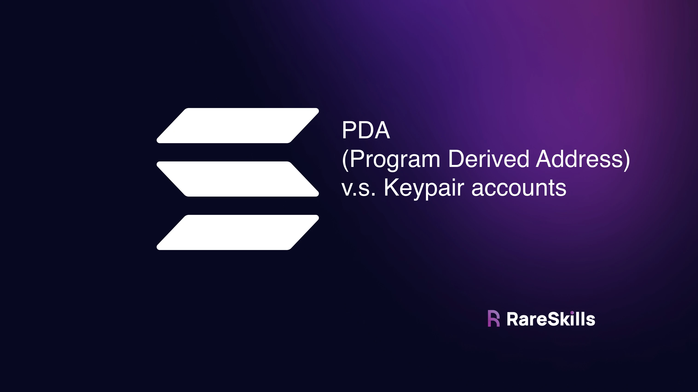
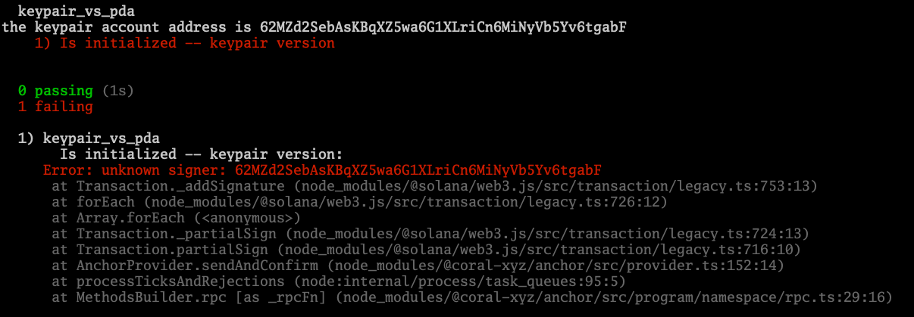
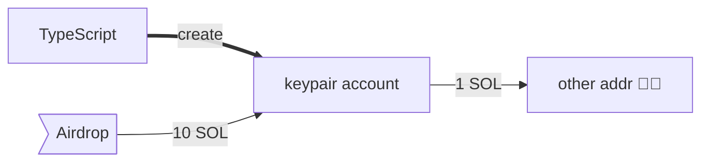
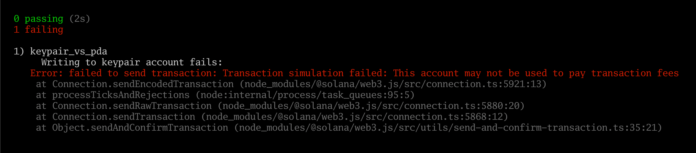
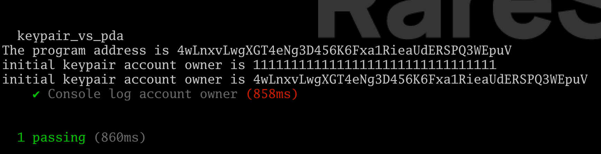

[PDA (Program Derived Address) vs Keypair Account in Solana](https://www.rareskills.io/post/solana-pda)

# PDA (Program Derived Address) vs Keypair Account in Solana



**A program derived address (PDA)** is an account whose address is derived from the address of the program that created it and the `seeds` passed in to the **`init` transaction**. Up until this point, we’ve only used PDAs.

It is also possible to create an account outside the program, then `init` that account inside the program.

Interestingly, the account we create outside the program will have a private key, but we will see this won’t have the security implications it would seem to have. We will refer to it as a **“keypair account.”**


## Account Creation Revisited

Before we get into keypair accounts, let’s review how we’ve been creating accounts in our [**Solana tutorials**](https://www.rareskills.io/solana-tutorial) so far. This is the same boilerplate we’ve been using, and it creates **program-derived addresses (PDA)**:


```bash
anchor init day_25_keypair_vs_pda
cd day_25_keypair_vs_pda
anchor build &> log_1.txt

cargo update -p toml_edit@0.21.1 --precise 1.17.4
anchor build &> log_2.txt

cargo update -p solana-program@1.18.4 --precise 1.17.4
anchor build &> log_3.txt

cargo update -p ahash@0.8.11 --precise 0.8.6
anchor build &> log_4.txt

ls -la
```
- `anchor test --skip-local-validator`
- `solana-test-validator --reset` (in another terminal)
- `solana logs` (in another terminal)


```rust
use anchor_lang::prelude::*;
use std::mem::size_of; 

declare_id!("4wLnxvLwgXGT4eNg3D456K6Fxa1RieaUdERSPQ3WEpuV");

#[program]
pub mod keypair_vs_pda {
    use super::*;

    pub fn initialize_pda(ctx: Context<InitializePDA>) -> Result<()> {
        Ok(())
    }
}

#[derive(Accounts)]
pub struct InitializePDA<'info> {

        // This is the program derived address
    #[account(init,
              payer = signer,
              space=size_of::<MyPDA>() + 8,
              seeds = [],
              bump)]
    pub my_pda: Account<'info, MyPDA>,

    #[account(mut)]
    pub signer: Signer<'info>,

    pub system_program: Program<'info, System>,
}

#[account]
pub struct MyPDA {
    x: u64,
}
```

The following is the associated Typescript code to call `initialize()`:

```typescript
import * as anchor from "@coral-xyz/anchor";
import { Program } from "@coral-xyz/anchor";
import { KeypairVsPda } from "../target/types/keypair_vs_pda";

describe("keypair_vs_pda", () => {
  anchor.setProvider(anchor.AnchorProvider.env());

  const program = anchor.workspace.KeypairVsPda as Program<KeypairVsPda>;

  it("Is initialized -- PDA version", async () => {
    const seeds = []
    const [myPda, _bump] = anchor.web3.PublicKey.findProgramAddressSync(seeds, program.programId);

    console.log("the storage account address is", myPda.toBase58());

    const tx = await program.methods.initializePda().accounts({myPda: myPda}).rpc();
  });
});
```

> All of this should be familiar so far, except that **we explicitly called our accounts “PDA”**.


## Program Derived Address

An account is a Program Derived Address (PDA) if the address of the account is derived from the address of the program, i.e. the `programId` in `findProgramAddressSync(seeds, program.programId)`. It is also a function of the `seeds`.

Specifically, we know it is a PDA because the `seeds` and `bump` are present in the **`init` macro**.


## Keypair Account

The following code will look very similar to the code above, but pay attention to the fact that the **`init` macro** lacks the `seeds` and `bump`:

```rust
use anchor_lang::prelude::*;
use std::mem::size_of;

declare_id!("4wLnxvLwgXGT4eNg3D456K6Fxa1RieaUdERSPQ3WEpuV");

#[program]
pub mod keypair_vs_pda {
    use super::*;

    pub fn initialize_keypair_account(ctx: Context<InitializeKeypairAccount>) -> Result<()> {
        Ok(())
    }
}

#[derive(Accounts)]
pub struct InitializeKeypairAccount<'info> {
        // This is the program derived address
    #[account(init,
              payer = signer,
              space = size_of::<MyKeypairAccount>() + 8,)]
    pub my_keypair_account: Account<'info, MyKeypairAccount>,

    #[account(mut)]
    pub signer: Signer<'info>,

    pub system_program: Program<'info, System>,
}

#[account]
pub struct MyKeypairAccount {
    x: u64,
}
```

When the `seed` and `bump` are absent, the Anchor program is now expecting us to create an account first, then pass the account to the program. Since we create the account ourselves, its address will not be **“derived from”** the address of the program. In other words, it will not be a program derived account (PDA).

Creating an account for the program is as simple as generating a new keypair (*in the same manner we used to [**test different signers in Anchor**](https://www.rareskills.io/post/anchor-signer)*). Yes, this may sound a bit terrifying that we hold the secret key for an account the program is using to store data — we will revisit this in a bit. 

For now, here is the Typescript code to create a new account and pass it to the program above. We will call attention to the important parts next:

```typescript
import * as anchor from "@coral-xyz/anchor";
import { Program } from "@coral-xyz/anchor";
import { KeypairVsPda } from "../target/types/keypair_vs_pda";

// this airdrops sol to an address
async function airdropSol(publicKey, amount) {
  let airdropTx = await anchor.getProvider().connection.requestAirdrop(publicKey, amount * anchor.web3.LAMPORTS_PER_SOL);
  await confirmTransaction(airdropTx);
}

async function confirmTransaction(tx) {
  const latestBlockHash = await anchor.getProvider().connection.getLatestBlockhash();
  await anchor.getProvider().connection.confirmTransaction({
    blockhash: latestBlockHash.blockhash,
    lastValidBlockHeight: latestBlockHash.lastValidBlockHeight,
    signature: tx,
  });
}

describe("keypair_vs_pda", () => {
  anchor.setProvider(anchor.AnchorProvider.env());

  const program = anchor.workspace.KeypairVsPda as Program<KeypairVsPda>;

  it("Is initialized -- keypair version", async () => {
        
    const newKeypair = anchor.web3.Keypair.generate();
    await airdropSol(newKeypair.publicKey, 1e9); // 1 SOL

    console.log("the keypair account address is", newKeypair.publicKey.toBase58());

    await program.methods.initializeKeypairAccount()
      .accounts({myKeypairAccount: newKeypair.publicKey})
      .signers([newKeypair]) // the signer must be the keypair
      .rpc();
  });
});
```

Some things we wish to call attention to::

- We added a utility function `airdropSol()` to airdrop SOL to the new keypair we created `newKeypair`. Without the SOL, it would not be able to pay for the transaction. Additionally, because this is the same account that will be used to store data, it needs a SOL balance to be [**rent exempt**](https://www.rareskills.io/post/solana-account-rent). When airdropping SOL, an additional **`confirmTransaction()` routine** is needed because there seems to be race conditions in the runtime about when the SOL is actually airdropped and when the transaction is confirmed. In French : "Lorsque vous larguez des SOL, une routine supplémentaire **`confirmTransaction()`** est nécessaire car il semble y avoir des conditions de concurrence dans le runtime concernant le moment où les SOL sont effectivement largués et lorsque la transaction est confirmée."
- We changed the `signers` from the default one to the `newKeypair`. When creating a keypair account, you are not able to create an account you do not hold the private key to.

```bash
  day_25_keypair_vs_pda
the keypair account address is 7eCJyTCJYKEftKgFM2pQFPpuYXuUw5VVeU6ujryahbgG
    ✔ Is initialized -- keypair version (650ms)
```


## It is not possible to initialize a keypair account you don’t hold the private key for

If you could create an account with an arbitrary address, that would be a major security risk as you could insert malicious data into an arbitrary account.

**Exercise**:
- Modify the test to generate a second keypair `secondKeypair`.
- Use the public key of the second keypair and replace .`accounts({myKeypairAccount: newKeypair.publicKey})` with `.accounts({myKeypairAccount: secondKeypair.publicKey})`. **Do not change the signer**.

You should see the test fail. You do not need to airdrop SOL to the new keypair since it is not the signer of the transaction.

You should see an error like the following:



```bash
  1) day_25_keypair_vs_pda
       Is initialized -- keypair version:
     Error: unknown signer: 5jsjh6fN1qtdUFDhqWP782rvcq6kaRrHVSWSDCgFyibu
      at Transaction._addSignature (node_modules/@solana/web3.js/src/transaction/legacy.ts:753:13)
      at forEach (node_modules/@solana/web3.js/src/transaction/legacy.ts:726:12)
```


## What if we tried to fake the PDA’s address?

**Exercise**: Instead of passing in `secondKeypair` from the exercise above, derive a PDA with:

```typescript
const seeds = []
const [pda, _bump] = anchor
                .web3
                .PublicKey
                .findProgramAddressSync(
                    seeds,
                    program.programId);
```

then replace the `myKeypairAccount` argument `.accounts({myKeypairAccount: pda})`

You should again see an **unknown signer error**.

```bash
  1) day_25_keypair_vs_pda
       Is initialized -- keypair version:
     Error: unknown signer: 6UJ3rp8EpgYBUmaeJQ5sHk7iMVZwcTXLDtbyqCyrhc1k
      at Transaction._addSignature (node_modules/@solana/web3.js/src/transaction/legacy.ts:753:13)
      at forEach (node_modules/@solana/web3.js/src/transaction/legacy.ts:726:12)
      at Array.forEach (<anonymous>)
```

The Solana runtime will not let you do this. If a program had PDAs suddenly appearing when they hadn’t been initialized, this would lead to serious security problems.


## Is it an issue that someone has an account for the private key?

It would seem that the person in possession of the private key would be able to spend SOL out of the account, and possibly bring it below the rent-exempt threshold. **However, the Solana runtime prevents this from happening when the account is initialized by a program**.

To see this, consider the following unit test:
- Create a **keypair account** in **Typescript**
- **Airdrop** sol to the **keypair account**
- **Transfer sol** from the keypair account to another address (*succeeds*)
- Initialize the keypair account
- Try to transfer sol from the keypair account using the keypair as the signer (*fails*)



**Add `"resolveJsonModule": true` to file : "*tsconfig.json*"**

```json
{
  "compilerOptions": {
    "types": ["mocha", "chai"],
    "typeRoots": ["./node_modules/@types"],
    "lib": ["es2015"],
    "module": "commonjs",
    "target": "es6",
    "esModuleInterop": true,
    "resolveJsonModule": true
  }
}
```

The code is shown below:
```typescript
import * as anchor from "@coral-xyz/anchor";
import { Program } from "@coral-xyz/anchor";
import { KeypairVsPda } from "../target/types/keypair_vs_pda";

// Change this to your path
import privateKey from '/Users/RareSkills/.config/solana/id.json';

import { fs } from fs;

async function airdropSol(publicKey, amount) {
  let airdropTx = await anchor.getProvider().connection.requestAirdrop(publicKey, amount * anchor.web3.LAMPORTS_PER_SOL);
  await confirmTransaction(airdropTx);
}

async function confirmTransaction(tx) {
  const latestBlockHash = await anchor.getProvider().connection.getLatestBlockhash();
  await anchor.getProvider().connection.confirmTransaction({
    blockhash: latestBlockHash.blockhash,
    lastValidBlockHeight: latestBlockHash.lastValidBlockHeight,
    signature: tx,
  });
}


describe("keypair_vs_pda", () => {
  const deployer = anchor.web3.Keypair.fromSecretKey(Uint8Array.from(privateKey));

  anchor.setProvider(anchor.AnchorProvider.env());

  const program = anchor.workspace.KeypairVsPda as Program<KeypairVsPda>;

  it("Writing to keypair account fails", async () => {
    const newKeypair     = anchor.web3.Keypair.generate();
    var   recieverWallet = anchor.web3.Keypair.generate();

    await airdropSol(newKeypair.publicKey, 10);

    var transaction = new anchor.web3.Transaction().add(
      anchor.web3.SystemProgram.transfer({
        fromPubkey: newKeypair.publicKey,
        toPubkey  : recieverWallet.publicKey,
        lamports  : 1 * anchor.web3.LAMPORTS_PER_SOL,
      }),
    );
    await anchor.web3.sendAndConfirmTransaction(anchor.getProvider().connection, transaction, [newKeypair]);
    console.log('sent 1 lamport') 

    await program.methods.initializeKeypairAccount()
      .accounts({myKeypairAccount: newKeypair.publicKey})
      .signers([newKeypair]) // the signer must be the keypair
      .rpc();

    console.log("initialized");

    // try to transfer again, this fails
    var transaction = new anchor.web3.Transaction().add(
      anchor.web3.SystemProgram.transfer({
        fromPubkey: newKeypair.publicKey,
        toPubkey  : recieverWallet.publicKey,
        lamports  : 1 * anchor.web3.LAMPORTS_PER_SOL,
      }),
    );
    await anchor.web3.sendAndConfirmTransaction(anchor.getProvider().connection, transaction, [deployer]); 
  });
});
```

Here is the expected error message:



Even though we hold the private keys to this account, we cannot “spend SOL” from the account as it is now owned by the program.


## Introduction to ownership and initialization

How does the Solana runtime know to block the transfer of SOL after initialization?

Exercise: modify the test to the code below. Pay attention to the console log statements that have been added. They are logging out an "owner" metadata field in the accounts and the address of the program:

```typescript
import * as anchor from "@coral-xyz/anchor";
import { Program } from "@coral-xyz/anchor";
import { KeypairVsPda } from "../target/types/keypair_vs_pda";

import privateKey from '/Users/jeffreyscholz/.config/solana/id.json';


async function airdropSol(publicKey, amount) {
  let airdropTx = await anchor.getProvider().connection.requestAirdrop(publicKey, amount * anchor.web3.LAMPORTS_PER_SOL);
  await confirmTransaction(airdropTx);
}

async function confirmTransaction(tx) {
  const latestBlockHash = await anchor.getProvider().connection.getLatestBlockhash();
  await anchor.getProvider().connection.confirmTransaction({
    blockhash           : latestBlockHash.blockhash,
    lastValidBlockHeight: latestBlockHash.lastValidBlockHeight,
    signature           : tx,
  });
}


describe("keypair_vs_pda", () => {
  const deployer = anchor.web3.Keypair.fromSecretKey(Uint8Array.from(privateKey));

  anchor.setProvider(anchor.AnchorProvider.env());

  const program = anchor.workspace.KeypairVsPda as Program<KeypairVsPda>;
  it("Console log account owner", async () => {

    console.log(`The program address is ${program.programId}`) 
    const newKeypair = anchor.web3.Keypair.generate();
    var recieverWallet = anchor.web3.Keypair.generate();

        // get account owner before initialization
    await airdropSol(newKeypair.publicKey, 10);
        const accountInfoBefore = await anchor.getProvider().connection.getAccountInfo(newKeypair.publicKey);
        console.log(`initial keypair account owner is ${accountInfoBefore.owner}`);

    await program.methods.initializeKeypairAccount()
      .accounts({myKeypairAccount: newKeypair.publicKey})
      .signers([newKeypair]) // the signer must be the keypair
      .rpc();

        // get account owner after initialization
        const accountInfoAfter = await anchor.getProvider().connection.getAccountInfo(newKeypair.publicKey);
        console.log(`initial keypair account owner is ${accountInfoAfter.owner}`);
  });
});
```

The screenshot below shows the expected result:



After initialization, the owner of the keypair account changed from **111...111** to the deployed program. We have not yet covered the significance of account ownership or the system program (*the address of all ones*) in depth in our [**Solana tutorial**](https://www.rareskills.io/solana-tutorial) just yet. However, this should give you an idea of what “initialization” is doing and why the owner of the private key can no longer transfer SOL out of the account.


## Should I use PDAs or Keypair accounts?

Once the account is initialized, they behave the same way, so practically there is not much difference.

The only significance difference (*which will not affect most applications*) is that:
- **PDAs** can only be initialized with a **size of 10,240 bytes**.
- But a **keypair account** can be initialized to the **full size of 10 MB**.

However, a **PDA** can be **resized up** to the **10 MB limit**.

Most applications use PDAs since they can be programatically addressed via the **`seeds` parameter**, but to access a keypair account you must know the address in advance. We include a discussion of keypair accounts because several tutorials online use them as examples, so we want you to have some context. In practice however, PDAs are the preferred way to store data.