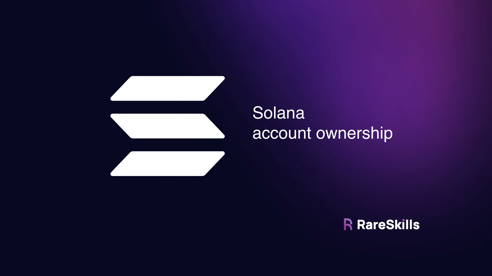
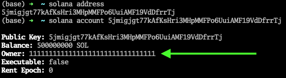
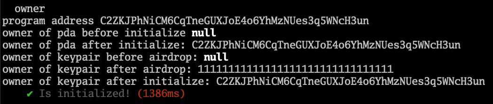
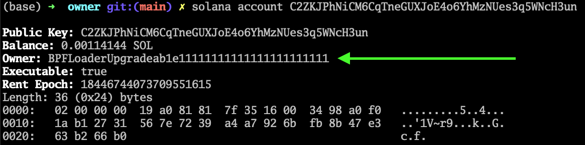
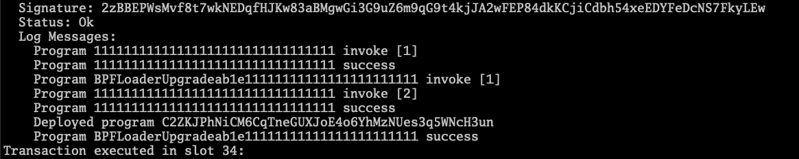

# Understanding Account Ownership in Solana: Transferring SOL out of a PDA



The owner of an account in Solana is able to reduce the SOL balance, write data to the account, and change the owner.

Here is the summary of account ownership in Solana:

1. The **system program** owns wallets and keypair accounts that haven’t been assigned ownership to a program (initialized).
2. The **BPFLoader** owns programs.
3. A program owns [**Solana PDA**](https://www.rareskills.io/post/solana-pda)s. It can also own keypair accounts if ownership has been transferred to the program (this is what happens during initialization).

We now examine the implications of these facts.


## The system program owns keypair accounts

To illustrate this, let’s look at our Solana wallet address using the Solana CLI and inspect its metadata:



```bash
❯ solana address
2mcDUMsXbfzeiyr8cNd4XrTp2uwKySC6ujGmCVfBfQ3j

❯ solana account 2mcDUMsXbfzeiyr8cNd4XrTp2uwKySC6ujGmCVfBfQ3j

Public Key: 2mcDUMsXbfzeiyr8cNd4XrTp2uwKySC6ujGmCVfBfQ3j
Balance: 500000000 SOL
Owner: 11111111111111111111111111111111
Executable: false
Rent Epoch: 0
```

Observe that the owner is **not our address**, but rather an account with address **111…111**. This is the **system program**, the same system program that moves SOL around as we saw in earlier tutorials.

**Only the owner of an account has the ability to modify the data in it**

This includes reducing the lamport data (*you do not need to be the owner to increase the lamport data of another account as we will see later*).

**Although you “own” your wallet in some metaphysical sense, you do not directly have the ability to write data into it or reduce the lamport balance because, from Solana runtime perspective, you are not the owner**.

The reason you are able to spend SOL in your wallet is because you **possess the private key** that generated the address, or public key. When the **system program** recognizes that you have produced a valid signature for the public key, then it will recognize your request to spend the lamports in the account as legitimate, then spend them according to your instructions.

However, the system program does not offer a mechanism for a signer to directly write data to the account.

The account showed in the example above is a keypair account, or what we might consider a “regular Solana wallet.” The system program is the owner of keypair accounts.
> - **You own** the private key of a wallet.
> - **sytem program** recognize you have a valid legitim signature.
> - **sytem program** do the things for you.


## PDAs and keypair accounts initialized by programs are owned by the program

**The reason programs can write to PDAs or keypair accounts that were created outside the program but initialized by the program, is because the program owns them**.

We will explore initialization more closely when we discuss the re-initialization attack, but for now, the important takeaway is that **initializing an account changes the owner of the account from the system program the program**.

To illustrate this, consider the following program that initializes a PDA and a keypair account. The Typescript test will console log the owner before and after the initialization transaction.

```bash
anchor init day_26_owner
cd day_26_owner
anchor build

cargo update -p solana-program@1.18.4 --precise 1.17.4
anchor build

cargo update -p ahash@0.8.11 --precise 0.8.6
anchor build

ls -la
```
- `anchor test --skip-local-validator`
- `solana-test-validator --reset` (in another terminal)
- `solana logs` (in another terminal)

If we try to ascertain the owner of an address that does not exist, **we get a `null`**.
> French : "*Si nous essayons de déterminer le propriétaire d'une adresse qui n'existe pas, **nous obtenons un résultat nul (`null`)**.*"

Here is the **Rust code**:
```rust
use anchor_lang::prelude::*;

declare_id!("C2ZKJPhNiCM6CqTneGUXJoE4o6YhMzNUes3q5WNcH3un");

#[program]
pub mod owner {
    use super::*;

    pub fn initialize_keypair(ctx: Context<InitializeKeypair>) -> Result<()> {
        Ok(())
    }

    pub fn initialize_pda(ctx: Context<InitializePda>) -> Result<()> {
        Ok(())
    }
}

#[derive(Accounts)]
pub struct InitializeKeypair<'info> {
    #[account(init, payer = signer, space = 8)]
    keypair: Account<'info, Keypair>,
    #[account(mut)]
    signer: Signer<'info>,
    system_program: Program<'info, System>,
}

#[derive(Accounts)]
pub struct InitializePda<'info> {
    #[account(init, payer = signer, space = 8, seeds = [], bump)]
    pda: Account<'info, Pda>,
    #[account(mut)]
    signer: Signer<'info>,
    system_program: Program<'info, System>,
}

#[account]
pub struct Keypair();

#[account]
pub struct Pda();
```

Here is the **Typescript code**:
```typescript
import * as anchor from "@coral-xyz/anchor";
import { Program } from "@coral-xyz/anchor";
import { Owner } from "../target/types/owner";

async function airdropSol(publicKey, amount) {
  let airdropTx = await anchor.getProvider().connection.requestAirdrop(publicKey, amount * anchor.web3.LAMPORTS_PER_SOL);
  await confirmTransaction(airdropTx);
}

async function confirmTransaction(tx) {
  const latestBlockHash = await anchor.getProvider().connection.getLatestBlockhash();
  await anchor.getProvider().connection.confirmTransaction({
    blockhash: latestBlockHash.blockhash,
    lastValidBlockHeight: latestBlockHash.lastValidBlockHeight,
    signature: tx,
  });
}

describe("owner", () => {
  // Configure the client to use the local cluster.
  anchor.setProvider(anchor.AnchorProvider.env());

  const program = anchor.workspace.Owner as Program<Owner>;

  it("Is initialized!", async () => {
    console.log("program address", program.programId.toBase58());    
    const seeds = []
    const [pda, bump_] = anchor.web3.PublicKey.findProgramAddressSync(seeds, program.programId);

    console.log("owner of pda before initialize:",
                await anchor.getProvider().connection.getAccountInfo(pda));

    await program.methods.initializePda()
    .accounts({pda: pda}).rpc();

    console.log("owner of pda after initialize:",
                (await anchor.getProvider().connection.getAccountInfo(pda)).owner.toBase58());

    let keypair = anchor.web3.Keypair.generate();

    console.log("owner of keypair before airdrop:",
                await anchor.getProvider().connection.getAccountInfo(keypair.publicKey));

    await airdropSol(keypair.publicKey, 1); // 1 SOL
   
    console.log("owner of keypair after airdrop:",
                (await anchor.getProvider().connection.getAccountInfo(keypair.publicKey)).owner.toBase58());
    
    await program.methods.initializeKeypair()
      .accounts({keypair: keypair.publicKey})
      .signers([keypair]) // the signer must be the keypair
      .rpc();

    console.log("owner of keypair after initialize:",
                (await anchor.getProvider().connection.getAccountInfo(keypair.publicKey)).owner.toBase58());
 
  });
});
```

The tests works as follows:

1. It predicts the address of the PDA and queries the owner. It gets `null`.
2. It calls `initializePDA()` then queries the owner. It gets the address of the program.
3. It generates a keypair account and queries the owner. It gets null.
4. It airdrops SOL to the keypair account. Now the owner is the system program, just like a normal wallet.
5. It calls `initializeKeypair()` then queries the owner. It gets the address of the program.

The test result screenshot is below:



```bash
  day_26_owner
program address CPYcaakSCpEzq42q2C6YJUCJX2FU1uDGLirsVFKkkC1r
owner of pda before initialize: null
owner of pda after initialize: CPYcaakSCpEzq42q2C6YJUCJX2FU1uDGLirsVFKkkC1r
owner of keypair before airdrop: null
owner of keypair after airdrop: 11111111111111111111111111111111
owner of keypair after initialize: CPYcaakSCpEzq42q2C6YJUCJX2FU1uDGLirsVFKkkC1r
    ✔ Is initialized! (1214ms)
```

This is how the program is able to write data to accounts: it owns them. During initialization, the program takes ownership over the account.

**Exercise**: Modify the test to print out the address of the keypair and the pda. Then use the Solana CLI to inspect who the owner is for those accounts. It should match what the test prints. Make sure the `solana-test-validator` is running in the backgorund so you can use the CLI.


## The BPFLoaderUpgradeable owns programs

Let’s use the **Solana CLI** to determine the owner of our program:



```bash
❯ solana account CPYcaakSCpEzq42q2C6YJUCJX2FU1uDGLirsVFKkkC1r

Public Key: CPYcaakSCpEzq42q2C6YJUCJX2FU1uDGLirsVFKkkC1r
Balance: 0.00114144 SOL
Owner: BPFLoaderUpgradeab1e11111111111111111111111
Executable: true
Rent Epoch: 18446744073709551615
Length: 36 (0x24) bytes
0000:   02 00 00 00  54 9f 06 6e  6d 61 ef 0a  7f 62 44 1e   ....T..nma...bD.
0010:   0f 19 6c d2  8b 1d 8a 35  50 fc a8 41  2a fe 75 d5   ..l....5P..A*.u.
0020:   2a a1 81 60                                          *..`
```

The wallet that deployed the program is not the owner of it. The reason Solana programs are able to be upgraded by the deploying wallet is because the **BpfLoaderUpgradeable** is able to write new bytecode to the program, and it will only accept new bytecode from a predesignated address: the address that originally deployed the program.

When we deploy (*or upgrade*) a program, we are actually making a call to the **BPFLoaderUpgradeable program**, as can be seen **in the logs**:



```bash
Transaction executed in slot 25:
  Signature: 56zgvWuiXKXgg1kTURrKZMJWwgiUBZmZgxsNRbgch7c95Q23uhpni6pK6s4PTmX9ubRNWMxLqAModAAYdFY2jk3
  Status: Ok
  Log Messages:
    Program 11111111111111111111111111111111 invoke [1]
    Program 11111111111111111111111111111111 success
    Program BPFLoaderUpgradeab1e11111111111111111111111 invoke [1]
    Program 11111111111111111111111111111111 invoke [2]
    Program 11111111111111111111111111111111 success
    Deployed program CPYcaakSCpEzq42q2C6YJUCJX2FU1uDGLirsVFKkkC1r
    Program BPFLoaderUpgradeab1e11111111111111111111111 success
Transaction executed in slot 28:
```


## Programs can transfer ownership of owned accounts

This is a feature you will probably not use very often, but here is the code to do it.


```bash
anchor init day_26_change_owner
cd day_26_change_owner
anchor build

cargo update -p solana-program@1.18.4 --precise 1.17.4
anchor build

cargo update -p ahash@0.8.11 --precise 0.8.6
anchor build

ls -la
```


**Rust:**
```rust
use anchor_lang::prelude::*;
use std::mem::size_of;
use anchor_lang::system_program;

declare_id!("Hxj38tktrD7YcSvKRxVrYQfxptkZd7NVbmrRKvLxznyA");


#[program]
pub mod change_owner {
    use super::*;

    pub fn initialize(ctx: Context<Initialize>) -> Result<()> {
        Ok(())
    }

    pub fn change_owner(ctx: Context<ChangeOwner>) -> Result<()> {
        let account_info = &mut ctx.accounts.my_storage.to_account_info();

        // assign is the function to transfer ownership
        account_info.assign(&system_program::ID);

        // we must erase all the data in the account or the transfer will fail
        let res = account_info.realloc(0, false);

        if !res.is_ok() {
            return err!(Err::ReallocFailed);
        }

        Ok(())
    }
}

#[error_code]
pub enum Err {
    #[msg("realloc failed")]
    ReallocFailed,
}

#[derive(Accounts)]
pub struct Initialize<'info> {

    #[account(init,
              payer = signer,
              space=size_of::<MyStorage>() + 8,
              seeds = [],
              bump)]
    pub my_storage: Account<'info, MyStorage>,
    
    #[account(mut)]
    pub signer: Signer<'info>,

    pub system_program: Program<'info, System>,
}

#[derive(Accounts)]
pub struct ChangeOwner<'info> {
    #[account(mut)]
    pub my_storage: Account<'info, MyStorage>,
}

#[account]
pub struct MyStorage {
    x: u64,
}
```

**Typescript:**

**Add `"resolveJsonModule": true` to file : "*tsconfig.json*"**

```json
{
  "compilerOptions": {
    "types": ["mocha", "chai"],
    "typeRoots": ["./node_modules/@types"],
    "lib": ["es2015"],
    "module": "commonjs",
    "target": "es6",
    "esModuleInterop": true,
    "resolveJsonModule": true
  }
}
```

```typescript
import * as anchor from "@coral-xyz/anchor";
import { Program } from "@coral-xyz/anchor";
import { ChangeOwner } from "../target/types/change_owner";

import privateKey from '/Users/jeffreyscholz/.config/solana/id.json';

describe("change_owner", () => {
  // Configure the client to use the local cluster.
  anchor.setProvider(anchor.AnchorProvider.env());

  const program = anchor.workspace.ChangeOwner as Program<ChangeOwner>;

  it("Is initialized!", async () => {
    const deployer = anchor.web3.Keypair.fromSecretKey(Uint8Array.from(privateKey));

    const seeds = []
    const [myStorage, _bump] = anchor.web3.PublicKey.findProgramAddressSync(seeds, program.programId);

    console.log("the storage account address is", myStorage.toBase58());

    await program.methods.initialize().accounts({myStorage: myStorage}).rpc();
    await program.methods.changeOwner().accounts({myStorage: myStorage}).rpc();
    
        // after the ownership has been transferred
        // the account can still be initialized again
        await program.methods.initialize().accounts({myStorage: myStorage}).rpc();
  });
});
```

Here are some things we want to call attention to:
- After transferring the account, the data must be erased in the same transaction. Otherwise, we could insert data into owned accounts of other programs. This is the **`account_info.realloc(0, false);` code**. The `false` means don’t zero out the data, but it makes no difference because there is no data anymore.
- Transferring account ownership does not permanently remove the account, it can be initialized again as the tests show.

```bash
  day_26_change_owner
the storage account address is Fb97vnifQibwAE63N4uUaETQFSqHu3oG6gZsXenUjJSR
    ✔ Is initialized! (1162ms)
```


Now that we clearly understand that programs own PDAs and keypair accounts initialized by them, the interesting and useful thing we can do is transfer SOL out of them.


## Transferring SOL out of a PDA: Crowdfund example

Below we show the code for a barebones crowdfunding app. The function of interest is the **`withdraw()` function** where the program transfer lamports out of the PDA and to the withdrawer.

```bash
anchor init day_26_crowdfund
cd day_26_crowdfund
anchor build

cargo update -p solana-program@1.18.4 --precise 1.17.4
anchor build

cargo update -p ahash@0.8.11 --precise 0.8.6
anchor build

ls -la
```

```rust
use anchor_lang::prelude::*;
use anchor_lang::system_program;
use std::mem::size_of;
use std::str::FromStr;

declare_id!("BkthFL8LV2V2MxVgQtA9tT5goeeJhUdxRPahzavqHPFZ");

#[program]
pub mod crowdfund {
    use super::*;

    pub fn initialize(ctx: Context<Initialize>) -> Result<()> {
        let initialized_pda = &mut ctx.accounts.pda;
        Ok(())
    }

    pub fn donate(ctx: Context<Donate>, amount: u64) -> Result<()> {
        let cpi_context = CpiContext::new(
            ctx.accounts.system_program.to_account_info(),
            system_program::Transfer {
                from: ctx.accounts.signer.to_account_info().clone(),
                to: ctx.accounts.pda.to_account_info().clone(),
            },
        );

        system_program::transfer(cpi_context, amount)?;

        Ok(())
    }

    pub fn withdraw(ctx: Context<Withdraw>, amount: u64) -> Result<()> {
        ctx.accounts.pda.sub_lamports(amount)?;
        ctx.accounts.signer.add_lamports(amount)?;

        // in anchor 0.28 or lower, use the following syntax:
        // **ctx.accounts.pda.to_account_info().try_borrow_mut_lamports()? -= amount;
        // **ctx.accounts.signer.to_account_info().try_borrow_mut_lamports()? += amount;
        Ok(())
    }
}

#[derive(Accounts)]
pub struct Initialize<'info> {
    #[account(mut)]
    pub signer: Signer<'info>,

    #[account(init, payer = signer, space=size_of::<Pda>() + 8, seeds=[], bump)]
    pub pda: Account<'info, Pda>,
    pub system_program: Program<'info, System>,
}

#[derive(Accounts)]
pub struct Donate<'info> {
    #[account(mut)]
    pub signer: Signer<'info>,

    #[account(mut)]
    pub pda: Account<'info, Pda>,
    pub system_program: Program<'info, System>,
}

#[derive(Accounts)]
pub struct Withdraw<'info> {
    #[account(mut, address = Pubkey::from_str("5jmigjgt77kAfKsHri3MHpMMFPo6UuiAMF19VdDfrrTj").unwrap())]
    pub signer: Signer<'info>,

    #[account(mut)]
    pub pda: Account<'info, Pda>,
}

#[account]
pub struct Pda {}
```

Because the program owns the PDA, it can directly deduct the lamport balance from the account.

When we transfer SOL as part of a normal wallet transaction, we don’t deduct the lamport balance directly as we are not the owner of the account. The system program owns the wallet, and will deduct the lamport balance if it sees a valid signature on a transaction requesting it to do so.

In this case, the program owns the PDA, and therefore can directly deduct lamports from it.

Some other items in the code worth calling attention to:

- We hardcoded who can withdraw from the PDA using the **constraint `#[account(mut, address = Pubkey::from_str("5jmigjgt77kAfKsHri3MHpMMFPo6UuiAMF19VdDfrrTj").unwrap())]`**. This checks that the address for that account matches the one in the string. For this code to work, we also needed to **import `use std::str::FromStr;`**. To test this code, change the address in the string to yours from **solana address**.
- With **Anchor 0.29**, we can use the syntax `ctx.accounts.pda.sub_lamports(amount)?;` and `ctx.accounts.signer.add_lamports(amount)?;`.
- For **earlier versions** of Anchor, use `ctx.accounts.pda.to_account_info().try_borrow_mut_lamports()? -= amount;` and `ctx.accounts.signer.to_account_info().try_borrow_mut_lamports()? += amount;`.
- You don’t need to own the account you are transferring lamports to.

**Here is the accompanying Typescript code:**
```typescript
import * as anchor from "@coral-xyz/anchor";
import { Program } from "@coral-xyz/anchor";
import { Crowdfund } from "../target/types/crowdfund";

describe("crowdfund", () => {
  // Configure the client to use the local cluster.
  anchor.setProvider(anchor.AnchorProvider.env());

  const program = anchor.workspace.Crowdfund as Program<Crowdfund>;

  it("Is initialized!", async () => {
    const programId = await program.account.pda.programId;

    let seeds = [];
    let pdaAccount = anchor.web3.PublicKey.findProgramAddressSync(seeds, programId)[0];

    const tx = await program.methods.initialize().accounts({
      pda: pdaAccount
    }).rpc();

    // transfer 2 SOL
    const tx2 = await program.methods.donate(new anchor.BN(2_000_000_000)).accounts({
      pda: pdaAccount
    }).rpc();

    console.log("lamport balance of pdaAccount",
        await anchor.getProvider().connection.getBalance(pdaAccount));

    // transfer back 1 SOL
    // the signer is the permitted address
    await program.methods.withdraw(new anchor.BN(1_000_000_000)).accounts({
      pda: pdaAccount
    }).rpc();

    console.log("lamport balance of pdaAccount",
        await anchor.getProvider().connection.getBalance(pdaAccount));

  });
});
```

```bash
  day_26_crowdfund
lamport balance of pdaAccount 2000946560
lamport balance of pdaAccount 1000946560
    ✔ Is initialized! (884ms)
```

**Exercise**: try to add more lamports to the receiving address than you withdraw from the PDA. i.e. change the code to the following:

```rust
ctx.accounts.pda.sub_lamports(amount)?; // sneak in an extra lamport
ctx.accounts.signer.add_lamports(amount + 1)?;
```

**The runtime should block you**.

Note that withdrawing the lamport balance below the rent-exempt threshold will result in the account getting closed. If there is data in the account, that will be erased. As such, programs should track how much SOL is required for rent exemption before withdrawing SOL unless they don’t care about the account getting erased.