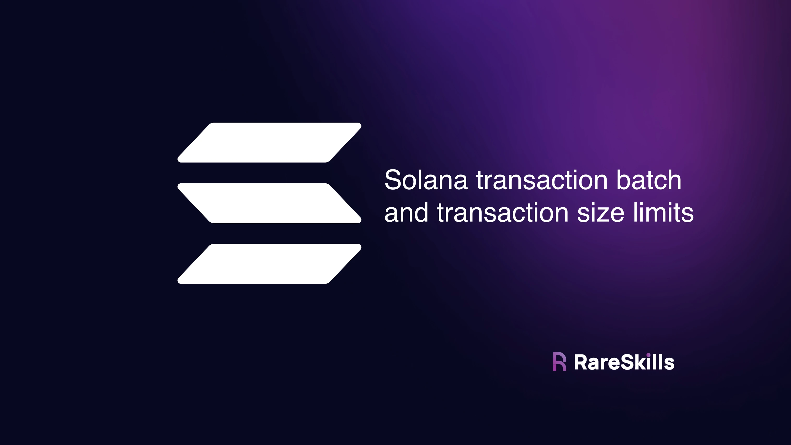
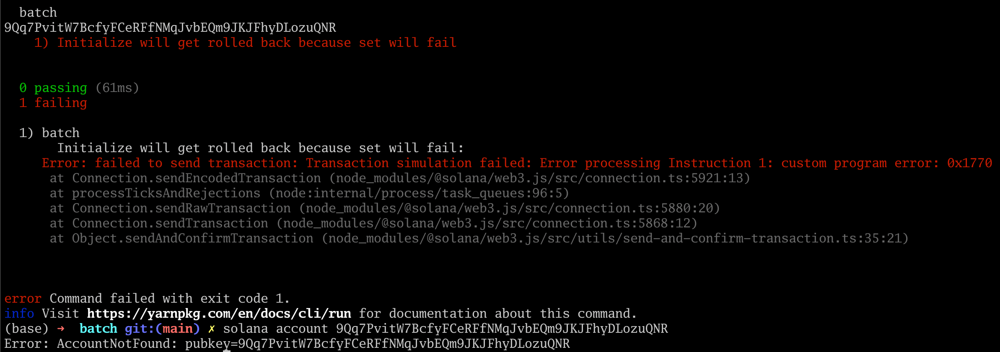
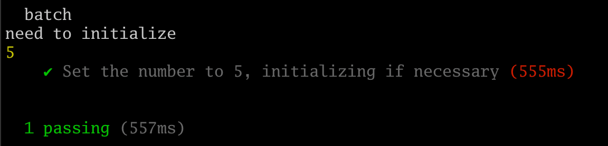
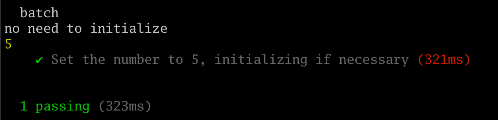
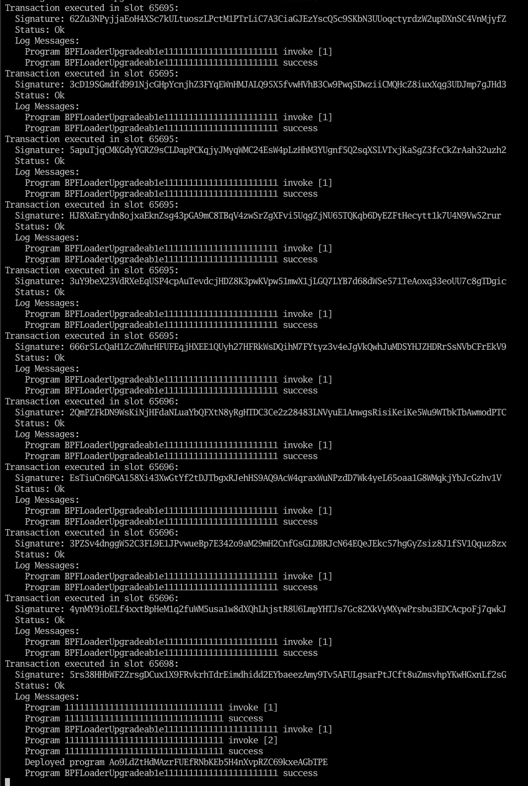
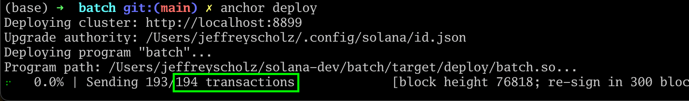

[Multicall in Solana: Batching Transactions and Transaction Size Limit](https://www.rareskills.io/post/solana-multiple-transactions)

# Multicall in Solana: Batching Transactions and Transaction Size Limit




## Solana has multicall built in

In Ethereum, we use the multicall pattern if we want to batch multiple transactions together atomically. If one fails, the rest fails.

Solana has this built into the runtime, so we don’t need to implement a multicall. In the example below, we initialize an account and write to it in one transaction — without using `init_if_needed`.

```typescript
import * as anchor from "@coral-xyz/anchor";
import { Program } from "@coral-xyz/anchor";
import { Batch } from "../target/types/batch";

describe("batch", () => {
  anchor.setProvider(anchor.AnchorProvider.env());

  const program = anchor.workspace.Batch as Program<Batch>;

  it("Is initialized!", async () => {
    const wallet = anchor.workspace.Batch.provider.wallet.payer;
    const [pda, _bump] = anchor.web3.PublicKey.findProgramAddressSync([], program.programId);

    const initTx = await program.methods.initialize()
                .accounts({pda: pda})
                    .transaction();

    // for u32, we don't need to use big numbers
    const setTx = await program.methods.set(5)
                .accounts({pda: pda})
                    .transaction();

    let transaction = new anchor.web3.Transaction();
    transaction.add(initTx);
    transaction.add(setTx);

    await anchor.web3.sendAndConfirmTransaction(anchor.getProvider().connection, transaction, [wallet]);

    const pdaAcc = await program.account.pda.fetch(pda);
    console.log(pdaAcc.value); // prints 5
  });
});
```

Here is the corresponding Rust code:

```rust
use anchor_lang::prelude::*;
use std::mem::size_of;

declare_id!("Ao9LdZtHdMAzrFUEfRNbKEb5H4nXvpRZC69kxeAGbTPE");

#[program]
pub mod batch {
    use super::*;

    pub fn initialize(ctx: Context<Initialize>) -> Result<()> {
        Ok(())
    }

    pub fn set(ctx: Context<Set>, new_val: u32) -> Result<()> {
        ctx.accounts.pda.value = new_val;
        Ok(())
    }
}

#[derive(Accounts)]
pub struct Initialize<'info> {
    #[account(init, payer = signer, space = size_of::<PDA>() + 8, seeds = [], bump)]
    pub pda: Account<'info, PDA>,

    #[account(mut)]
    pub signer: Signer<'info>,

    pub system_program: Program<'info, System>,
}

#[derive(Accounts)]
pub struct Set<'info> {
    #[account(mut)]
    pub pda: Account<'info, PDA>,
}

#[account]
pub struct PDA {
    pub value: u32,
}
```

Some comments on the code above:

- When passing a **`u32` value** or smaller to Rust, we do not need to use a Javascript bignumber.
- Instead of doing `await program.methods.initialize().accounts({pda: pda}).rpc()` we do `await program.methods.initialize().accounts({pda: pda}).transaction()` to create a transaction.


## Solana Transaction Size Limit

The total size of a Solana transaction cannot exceed **1232 bytes**.

The implication of this is that you will not be able to batch an “unlimited” number of transactions and just pay more gas like you would in Ethereum.


## Demonstrating atomicity of batched transactions

Let’s alter our set function in Rust to always fail. This will help us see that the **`initialize()` transaction** gets rolled back if one of the subsequent batched transactions fails.

The following Rust program always returns an error when `set()` is called:

```rust
use anchor_lang::prelude::*;
use std::mem::size_of;

declare_id!("Ao9LdZtHdMAzrFUEfRNbKEb5H4nXvpRZC69kxeAGbTPE");

#[program]
pub mod batch {
    use super::*;

    pub fn initialize(ctx: Context<Initialize>) -> Result<()> {
        Ok(())
    }

    pub fn set(ctx: Context<Set>, new_val: u32) -> Result<()> {
        ctx.accounts.pda.value = new_val;
        return err!(Error::AlwaysFails);
    }
}

#[error_code]
pub enum Error {
    #[msg(always fails)]
    AlwaysFails,
}

#[derive(Accounts)]
pub struct Initialize<'info> {
    #[account(init, payer = signer, space = size_of::<PDA>() + 8, seeds = [], bump)]
    pub pda: Account<'info, PDA>,

    #[account(mut)]
    pub signer: Signer<'info>,

    pub system_program: Program<'info, System>,
}

#[derive(Accounts)]
pub struct Set<'info> {
    #[account(mut)]
    pub pda: Account<'info, PDA>,
}

#[account]
pub struct PDA {
    pub value: u32,
}
```

The following Typescript code sends a batch transaction of initialization and set:

```typescript
import * as anchor from "@coral-xyz/anchor";
import { Program, SystemProgram } from "@coral-xyz/anchor";
import { Batch } from "../target/types/batch";

describe("batch", () => {
  // Configure the client to use the local cluster.
  anchor.setProvider(anchor.AnchorProvider.env());

  const program = anchor.workspace.Batch as Program<Batch>;

  it("Set the number to 5, initializing if necessary", async () => {
    const wallet = anchor.workspace.Batch.provider.wallet.payer;
    const [pda, _bump] = anchor.web3.PublicKey.findProgramAddressSync([], program.programId);

    // console.log the address of the pda
    console.log(pda.toBase58());

    let transaction = new anchor.web3.Transaction();
    transaction.add(await program.methods.initialize().accounts({pda: pda}).transaction());
    transaction.add(await program.methods.set(5).accounts({pda: pda}).transaction());

    await anchor.web3.sendAndConfirmTransaction(anchor.getProvider().connection, transaction, [wallet]);
  });
});
```

When we run the test, then query the local validator for the pda account, we see it doesn’t exist. Even though the initialize transaction was first, the set transaction which came after reverted, causing the entire transaction to get cancelled, and thus no account was initialized.




## “Init if needed” on the frontend

You can simulate the behavior of `init_if_needed` using frontend code while having a separate **`initialize()` function**. From the user’s perspective however, this will all get smoothed out as they don’t have to issue multiple transactions when using an account for the first time.


To determine if an account needs to be initialized, we check if it has zero lamports or is owned by the system program. Here is how we can do so in Typescript:

```typescript
import * as anchor from "@coral-xyz/anchor";
import { Program, SystemProgram } from "@coral-xyz/anchor";
import { Batch } from "../target/types/batch";

describe("batch", () => {
  anchor.setProvider(anchor.AnchorProvider.env());

  const program = anchor.workspace.Batch as Program<Batch>;

  it("Set the number to 5, initializing if necessary", async () => {
    const wallet = anchor.workspace.Batch.provider.wallet.payer;
    const [pda, _bump] = anchor.web3.PublicKey.findProgramAddressSync([], program.programId);

    let accountInfo = await anchor.getProvider().connection.getAccountInfo(pda);

    let transaction = new anchor.web3.Transaction();
    if (accountInfo == null || accountInfo.lamports == 0 || accountInfo.owner == anchor.web3.SystemProgram.programId) {
      console.log("need to initialize");
      const initTx = await program.methods.initialize().accounts({pda: pda}).transaction();
      transaction.add(initTx);
    }
    else {
      console.log("no need to initialize");
    }

    // we're going to set the number anyway
    const setTx = await program.methods.set(5).accounts({pda: pda}).transaction();
    transaction.add(setTx);

    await anchor.web3.sendAndConfirmTransaction(anchor.getProvider().connection, transaction, [wallet]);

    const pdaAcc = await program.account.pda.fetch(pda);
    console.log(pdaAcc.value);
  });
});
```

We also need to modify our Rust code to not forcibly fail on the `set()` operation.

```rust
use anchor_lang::prelude::*;
use std::mem::size_of;

declare_id!("Ao9LdZtHdMAzrFUEfRNbKEb5H4nXvpRZC69kxeAGbTPE");

#[program]
pub mod batch {
    use super::*;

    pub fn initialize(ctx: Context<Initialize>) -> Result<()> {
        Ok(())
    }

    pub fn set(ctx: Context<Set>, new_val: u32) -> Result<()> {
        ctx.accounts.pda.value = new_val;
        Ok(()) // ERROR HAS BEEN REMOVED
    }
}

#[derive(Accounts)]
pub struct Initialize<'info> {
    #[account(init, payer = signer, space = size_of::<PDA>() + 8, seeds = [], bump)]
    pub pda: Account<'info, PDA>,

    #[account(mut)]
    pub signer: Signer<'info>,

    pub system_program: Program<'info, System>,
}

#[derive(Accounts)]
pub struct Set<'info> {
    #[account(mut)]
    pub pda: Account<'info, PDA>,
}

#[account]
pub struct PDA {
    pub value: u32,
}
```

If we run the test twice against the same local validator instance, we will get the following outputs:

**First test run:**



**Second test run:**




## How does Solana deploy programs over 1232 bytes large?

If you create a new Solana program and **run `anchor deploy`** (*or `anchor test`*) you will see in the logs there are numerous transactions to the **BFPLoaderUpgradeable**:

  

Here, Anchor is splitting up deploying the bytecode into multiple transactions because deploying the entire bytecode at once won’t fit in a single transaction. We can see how many transactions it took by directing the logs into the file and counting the number of transactions that happened:

```bash
logs logs.txt
# run `anchor deploy` in another shell
grep "Transaction executed" logs.txt | wc -l
```

This will roughly match what temporarily appears after the **`anchor test` or `anchor deploy` command**:



The exact process for how the transactions are batched up are described in [**Solana’s Documentation: How solana program deploy works**](https://solana.com/docs/programs/deploying#how-solana-program-deploy-works).

The list of transactions are separate transactions, not a batched transaction. I**f it were batched, it would exceed the 1232 byte limit**.