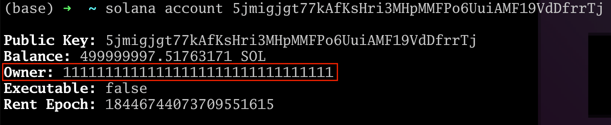
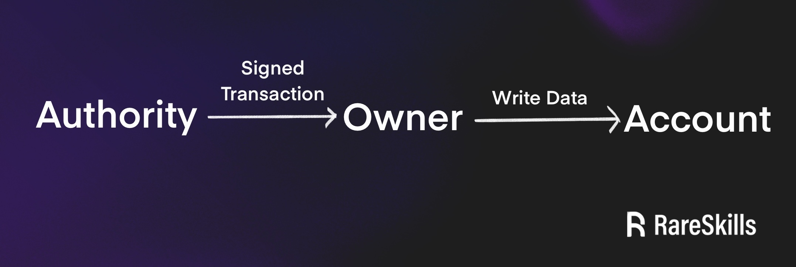
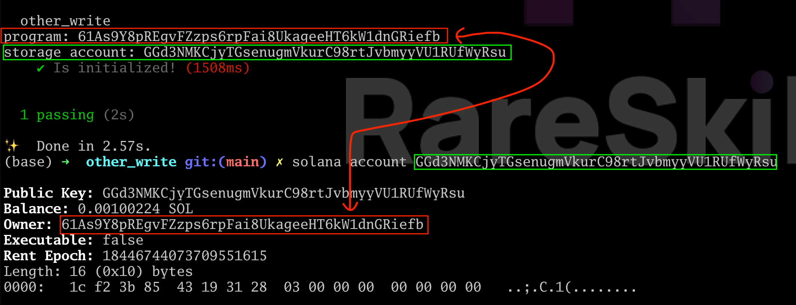
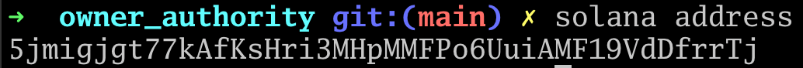
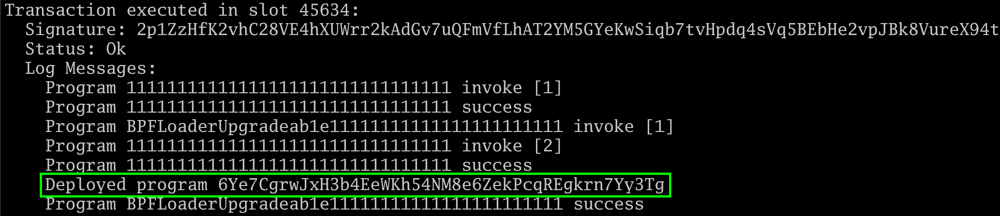
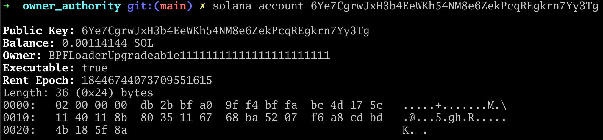
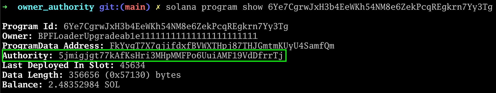
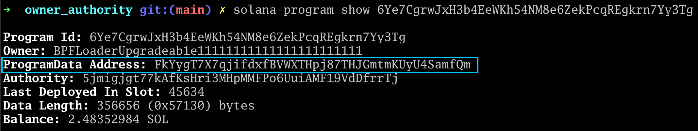
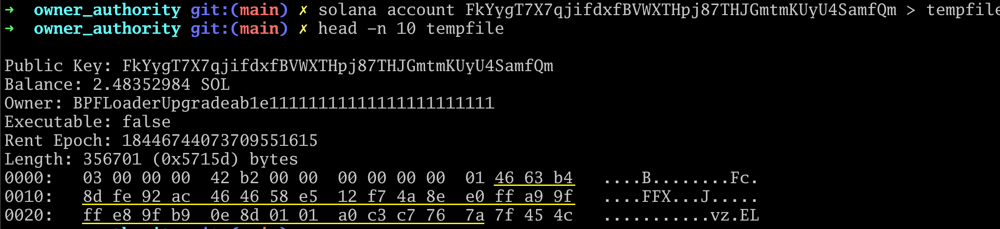

[Owner vs Authority in Solana](https://www.rareskills.io/post/solana-authority)

--------

# Owner vs Authority in Solana

Newcomers to Solana are frequently confused by the distinction between an “owner” and an “authority.” This article attempts to clear up the confusion as succinctly as possible.


## Owner vs Authority

Only programs can write data to accounts — specifically, only to accounts they own. A program cannot write data to arbitrary accounts.

Programs of course cannot spontaneously write data to accounts. They need to receive an instruction to do so from a wallet. However, programs will generally only accept write instructions for a particular account from a privileged wallet: the authority.

An owner of an account is a program. An authority is a wallet. An authority sends a transaction to a program and that program can write to the account.

All accounts in Solana have the following fields, which are mostly self-explanatory:
- Public Key
- lamport balance
- owner
- executable (*a boolean flag*)
- rent_epoch (*can be ignored for rent-exempt accounts*)
- data

We can see these by running `solana account <our wallet address>` in the terminal (*with the Solana validator running in the background*):



Note something interesting: **we are not the owner of our wallet!** The address **111…111** is the **system program**.

Why does the system program own wallets, instead of wallets owning themselves?

**Only the owner of an account can modify the data in it.**

The implication is that we are not able to modify our balance directly. Only the system program can do that. To transfer SOL out of our account, we send a signed transaction to the system program. The system program verifies we own the private key to the account, and then it modifies the balance on our behalf.

This is a pattern you will frequently see in Solana: only the owner of the account can modify the data in the account. The program will modify the data in the account if it sees a valid signature from a predesignated address: an authority.

**An authority is an address from which a program will accept instructions if it sees a valid signature. An authority cannot modify an account directly. It needs to work through a program that owns the account it is trying to modify.**



However the owner is always a program, and that program will modify the account on behalf of someone else if the signature for the transaction is valid.

We saw this for example, in our tutorial on [**modifying accounts with different signers**](https://www.rareskills.io/post/anchor-signer).

**Exercise**: Create a program that initializes a storage account. You will want to have the address of the program and storage accounts handy. Consider adding the following code to the tests:

```typescript
console.log(`program: ${program.programId.toBase58()}`);
console.log(`storage account: ${myStorage.toBase58()}`);
```

Then **run `solana account <storage account>`** on the account that got initialized. You should see the owner being the program.

Here is a screenshot of the exercise being run:



When we look at the metadata of the storage account, we see the program is the owner.

**Because the program owns the storage account, it is able to write to it**. Users cannot write to the storage account directly, they sign a transaction and ask the program to write the data.


## The owner in Solana is very different from the owner in Solidity

In Solidity, we usually refer to the owner as a special address with admin privileges over the smart contract. The “owner” is not a concept that exists at the Ethereum runtime level, it is a design pattern applied to Solidity contracts. An owner in Solana is much more fundamental. In Ethereum, a smart contract can only write to its own storage slots. Imagine we had a mechanism to allow an Ethereum smart contract to be able to write to some other storage slot. In Solana terms, it would become the owner or those storage slots.


## Authority can mean who deployed a contract and who can send write transactions for a particular account

An authority can be a construct at the program level. In our tutorial on [**Anchor signers**](https://www.rareskills.io/post/anchor-signer), we made a program where Alice could deduct points from her account to transfer to someone else. To know that only Alice can send a deduction transaction for that account, we stored her address in the account:

```rust
#[account]
pub struct Player {
    points: u32,
    authority: Pubkey
}
```

Solana uses a similar mechanism to remember who deployed a program. In our tutorial on [**Anchor deploy**](https://www.rareskills.io/post/solana-anchor-deploy), we noted that the wallet that deployed a program is also able to upgrade it.

“Upgrading” a program is the same as writing new data to it — i.e. new bytecode. Only the owner of the program can write to it (this program is `BPFLoaderUpgradeable` as we will see soon).

Therefore, how does Solana know how to give upgrade privileges to the wallet that deployed a certain program?


## Viewing the authority of a program from the command line

Before we deploy the program, let’s see what wallet anchor is using by running solana address in the terminal:



Take note that our address is **5jmi...rrTj**. Now let’s create a program.

Be sure `solana-test-validator` and `solana logs` are running in the background, then deploy the Solana program:
```bash
anchor init owner_authority
cd owner_authority
anchor build
anchor test --skip-local-validator
```

When we look at the logs, we see the address of the program we just deployed:



Remember, everything is an account on Solana, including programs. Now let’s inspect this account using the `solana account 6Ye7CgrwJxH3b4EeWKh54NM8e6ZekPcqREgkrn7Yy3Tg`.

We get the following result:



**Note the authority field is absent, because “authority” is not a field that Solana accounts hold**. If you scroll up to the top of this article, you will see the keys in the console match the fields we listed at the top of the article.

Here, the “owner” is **BPFLoaderUpgradeable111…111**, which is the **owner of all Solana programs**.

Now let’s run `solana program show 6Ye7CgrwJxH3b4EeWKh54NM8e6ZekPcqREgkrn7Yy3Tg`, where **6Ye7...y3TG** is the address of our program:



In the green box above, we see our wallet address — the one used to deploy the program and what we printed out earlier with `solana address`:


But this leads us to an important question…


## Where does Solana store the “authority” for the program, which is currently our wallet?

It isn’t a field in an account, so it must be in the **`data` field** of some Solana account. The “authority” is stored in the **ProgramData Address** where the bytecode of the program is stored:




## Hex encoding of our wallet (the authority)

Before we proceed, it will be helpful to convert the **base58** encoding of the **ProgramData Address** to a hex representation. The code to accomplish this is provided at the end of the article, but for now we ask the reader to accept that the hex representation of our Solana wallet address `5jmigjgt77kAfKsHri3MHpMMFPo6UuiAMF19VdDfrrTj` is:

`4663b48dfe92ac464658e512f74a8ee0ffa99fffe89fb90e8d0101a0c3c7767a`


## Viewing the data in the ProgramData Address account where the executable is stored

We can view the **ProgramData Address account** with `solana account`, but we will also send it to a temporary file to avoid dumping too much data to the terminal.

```bash
solana account FkYygT7X7qjifdxfBVWXTHpj87THJGmtmKUyU4SamfQm > tempfile

head -n 10 tempfile
```

The output from the above commands shows our wallet (*in hex*) embedded into the `data`. Observe that the **yellow underlined** hex code matches the hex encoding of our wallet (*the authority*):




## The bytecode of a program is stored in a separate account, not the address of the program

This should be implied from the above sequence of commands, but it is worth stating explicitly. Even though the a program is an account that is marked as executable, the bytecode is not stored in its own data field, but in another account (which somewhat confusingly is not executable, it merely stores bytecode).

**Exercise**: Can you find where the program stores the address of the account that holds the bytecode? The addendum in this article has code that may be useful.


## Summary

Only the owner of a program can change its data. The owner of Solana programs is the **BPFLoaderUpgradeable** system program, so by default, the wallet that deployed the program cannot change the data (*bytecode*) stored in an account.

To enable upgrading programs, the Solana runtime embeds the wallet of the deployer into the bytecode of the program. It refers to this field as the “authority.”

When the deploying wallet tries to upgrade the bytecode, the Solana runtime will check if the transaction signer is the authority. If the transaction signer matches the authority, then the **BPFLoaderUpgradeable** will update the bytecode of the program on behalf of the **authority**.


## Addendum: converting base 58 to hex

The following Python code will accomplish the conversion. It was generated by a chatbot, and therefore should only be used for illustrative purposes:

```python
def decode_base58(bc, length):
    base58_digits = '123456789ABCDEFGHJKLMNPQRSTUVWXYZabcdefghijkmnopqrstuvwxyz'
    n = 0
    for char in bc:
        n = n * 58 + base58_digits.index(char)
    return n.to_bytes(length, 'big')

def find_correct_length_for_decoding(base58_string):
    for length in range(25, 50):  # Trying lengths from 25 to 50
        try:
            decoded_bytes = decode_base58(base58_string, length)
            return decoded_bytes.hex()
        except OverflowError:
            continue
    return None

# Base58 string to convert
base58_string = "5jmigjgt77kAfKsHri3MHpMMFPo6UuiAMF19VdDfrrTj"

# Convert and get the hexadecimal string
hex_string = find_correct_length_for_decoding(base58_string)
print(hex_string)
```
