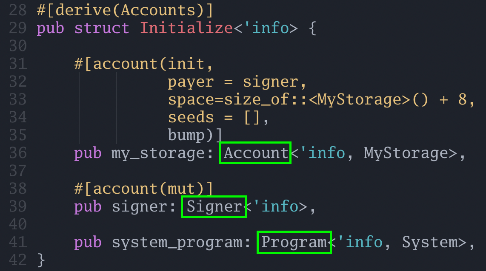
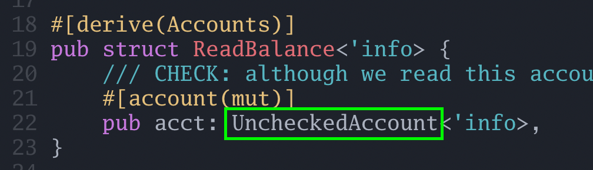
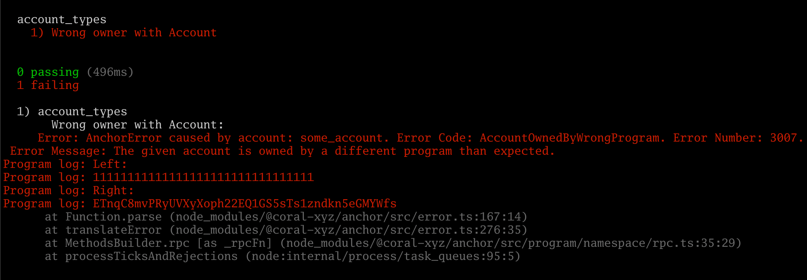
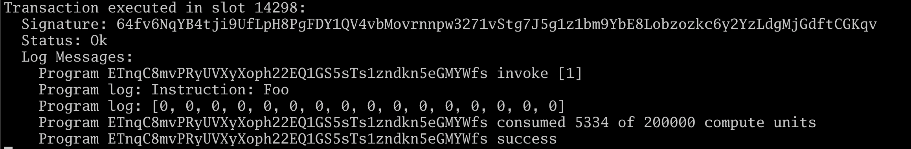
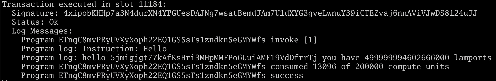

[#[derive(Accounts)] in Anchor: different kinds of accounts](https://www.rareskills.io/post/anchor-account-types)


# #[derive(Accounts)] in Anchor: different kinds of accounts


#[Derive(Accounts)] in Solana Anchor is an attribute-like macro for structs that holds references to all the accounts the function will access during its execution.


## In Solana, every account the transaction will access must be specified in advance

One reason Solana is so fast is that it executes transactions in parallel. That is, if Alice and Bob both want to do a transaction, Solana will try to process their transactions simultaneously. However there is a problem if their transactions conflict by accessing the same storage. For example, suppose both Alice and Bob are trying to write to the same account. Clearly their transactions cannot be run in parallel.

For Solana to know that Alice and Bob's transaction cannot be parallelized, both Alice and Bob must specify in advance all the accounts their transaction will update.

Since both Alice and Bob specify a (storage) account, the Solana runtime can infer that both transactions conflict. One must be chosen (presumably, the one that paid the higher priority fee), and the other will end up failing.

This is why each function has it's own separate **`#[derive(Accounts)]` struct**. Each field in the struct is an account that the program intends to (but is not required to) access during execution.

Some Ethereum developers may notice the similarity with this requirement and [**EIP 2930 access list transactions**](https://www.rareskills.io/post/eip-2930-optional-access-list-ethereum).

The type of account signals to Anchor how you intend to interact with the account.


## Account types you will use most frequently: Account, Unchecked Account, System Program, and Signer

In our code to initialize storage, we saw three different “kinds” of accounts:

- `Account`
- `Signer`
- `Program`

**Here is the code again:**



And when we read an account balance, we saw a fourth type:

- `UncheckedAccount`

**Here is the code we used:**



Each of the items we highlighted with the green boxes are imported via the `anchor_lang::prelude::*;` at the top of the files.

The purpose of `Account`, `UncheckedAccount`, `Signer`, and `Program` are to perform some kind of a check on the account passed in before proceeding, and also to expose functions for interacting with those accounts.

We will further explain each of these four types in the following sections.


## Account

The Account type will check that the owner of the account being loaded is actually owned by the program. If the owner does not match, then it won’t load. This serves as an important safety measure to not accidentally read in data the program did not create.

In the following example, we create a keypair account and try to pass it to `foo`. Because the account is not owned by the program, the transaction fails.

**Rust:**
```rust
use anchor_lang::prelude::*;

declare_id!("ETnqC8mvPRyUVXyXoph22EQ1GS5sTs1zndkn5eGMYWfs");

#[program]
pub mod account_types {    
	use super::*;   

	pub fn foo(ctx: Context<Foo\>) ->Result<()> {        
		// we don't do anything with the account SomeAccount        
		Ok(())    
		}
}

#[derive(Accounts)]
pub struct Foo<'info> {    
	some_account: Account<'info, SomeAccount\>,
}

#[account]
pub struct SomeAccount {}
```

**Typescript:**

```typescript
import * as anchor from "@coral-xyz/anchor";
import { Program } from "@coral-xyz/anchor";
import { AccountTypes } from "../target/types/account_types";

describe("account_types", () \=> {
	async function airdropSol(publicKey, amount) {    
		let airdropTx = await anchor
			.getProvider()
			.connection.requestAirdrop(
				publicKey, 
				amount * anchor.web3.LAMPORTS_PER_SOL
			);  
  
		await confirmTransaction(airdropTx);  
	}  

	async function confirmTransaction(tx) {    
		const latestBlockHash = await anchor
			.getProvider()
			.connection.getLatestBlockhash();
   
		await anchor
			.getProvider()
			.connection.confirmTransaction({      
				blockhash: latestBlockHash.blockhash,      	
				lastValidBlockHeight: latestBlockHash.lastValidBlockHeight,      
				signature: tx,    
		});  
	}  

// Configure the client to use the local cluster.  
anchor.setProvider(anchor.AnchorProvider.env());  

const program = anchor.workspace.AccountTypes as Program<AccountTypes>;  

it("Wrong owner with Account", async () \=> {    
	const newKeypair = anchor.web3.Keypair.generate();    
	await airdropSol(newKeypair.publicKey, 10);    

	await program[.](http://program.methods.foo)[methods](http://program.methods.foo)
		[.](http://program.methods.foo)[foo](http://program.methods.foo)()
		.accounts({someAccount: newKeypair
		.publicKey}).rpc();  
	});
});
```

**Here is the output from executing the tests:**



If we add an **`init` macro** to `Account`, then it will try to transfer ownership from the system program to this program. However, the code above does not have an **`init` macro**.

More about the `Account` type can be found in the docs: [**Account in anchor_lang::accounts::account - Rust**](https://docs.rs/anchor-lang/latest/anchor_lang/accounts/account/struct.Account.html)


## UncheckedAccount or AccountInfo

`UncheckedAccount` is an **alias** for `AccountInfo`. This does not check for ownership, so care must be taken as it will accept arbitrary accounts.

Here is an example of using `UncheckedAccount` to read the data of an account it does not own.

```rust
use anchor_lang::prelude::*;

declare_id!("ETnqC8mvPRyUVXyXoph22EQ1GS5sTs1zndkn5eGMYWfs");

#[program]
pub mod account_types {    
	use super::*;    
	
	pub fn foo(ctx: Context<Foo\>) ->Result<()> {        
		let data = &ctx.accounts.some_account.try_borrow_data()?;        
		msg!("{:?}", data);        
		Ok(())    
	}
}

#[derive(Accounts)]
pub struct Foo<'info> {    
	/// CHECK: we are just printing the data    
	some_account: AccountInfo<'info\>,
}

Here is our Typescript code. Note that we are calling the system program directly to create the keypair account so that we can allocate 16 bytes of data.

import * as anchor from "@coral-xyz/anchor";
import { Program } from "@coral-xyz/anchor";
import { AccountTypes } from "../target/types/account_types";

describe("account_types", () \=> {  
	const wallet = anchor.workspace.AccountTypes.provider.wallet;  
	
	// Configure the client to use the local cluster.  
	anchor.setProvider(anchor.AnchorProvider.env());  

	const program = anchor.workspace.AccountTypes as Program<AccountTypes>;  
	it("Load account with accountInfo", async () \=> {    
	// CREATE AN ACCOUNT NOT OWNED BY THE PROGRAM    
	const newKeypair = anchor.web3.Keypair.generate();    
	const tx = new anchor.web3.Transaction().add(      
		anchor.web3.SystemProgram.createAccount({        
			fromPubkey: wallet.publicKey,        
	 		newAccountPubkey: newKeypair.publicKey,        
			space: 16,        
			lamports: await anchor          
				.getProvider()
				.connection
				.getMinimumBalanceForRentExemption(32),        		
			programId: program.programId,      
		})    
	);    

	await anchor.web3.sendAndConfirmTransaction(      
		anchor.getProvider().connection,      
		tx,      
		[wallet.payer, newKeypair]    
	);    

	// READ THE DATA IN THE ACCOUNT    
	await program.methods      
		.foo()      
		.accounts({ someAccount: newKeypair.publicKey })      
		.rpc();  
	});
});
```

After the program runs, we can see it printed out the data in the account, which holds 16 zero bytes:



We needed to use this account type when we were passing in an arbitrary address, but be very careful how the data is used, because a hacker may be able to craft malicious data in an account then pass that to the Solana program.


## Signer

This type will check that the **`Signer` account** signed the transaction; it checks that the signature matches the public key of the account.

Because a signer is also an account, you can read the Signer’s balance or data (if any) stored in the account, though it’s primary purpose is to validate signatures.

According to the docs [**Signer in anchor_lang::accounts::signer - Rust**](https://docs.rs/anchor-lang/latest/anchor_lang/accounts/signer/struct.Signer.html), `Signer` is a type validating that the account signed the transaction. No other ownership or type checks are done. If this is used, one should not try to access the underlying account data.

**Rust example:**

```rust
use anchor_lang::prelude::*;

declare_id!("ETnqC8mvPRyUVXyXoph22EQ1GS5sTs1zndkn5eGMYWfs");#

[program]
pub mod account_types {    
	use super::*;    
	pub fn hello(ctx: Context<Hello\>) ->Result<()> {        
		let lamports = ctx.accounts.signer.lamports();        
		let address = &ctx.accounts
			.signer
			.signer_key().unwrap();        
		msg!(
			"hello {:?} you have {} lamports", 
			address, 
			lamports
		);        
		Ok(())    
}}

#[derive(Accounts)]
pub struct Hello<'info> {    
	pub signer: Signer<'info>,
}
```


**Typescript:**

```javascript
import * as anchor from "@coral-xyz/anchor";
import { Program } from "@coral-xyz/anchor";
import { AccountTypes } from "../target/types/account_types";

describe("account_types", () \=> {  
	anchor.setProvider(anchor.AnchorProvider.env()); 
 
	const program = anchor.workspace.AccountTypes as Program<AccountTypes\>;  

	it("Wrong owner with Account", async () \=> {    
		await program.methods.hello().rpc();  
	});
});
```

**Here is the output of the program:**




## Program

This should be self explanatory. It signals to Anchor the account is an executable one, i.e. a program, and you may issue to it a cross program invocation. The one we have been using is the system program, though later we will use our own programs.