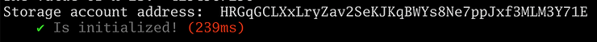
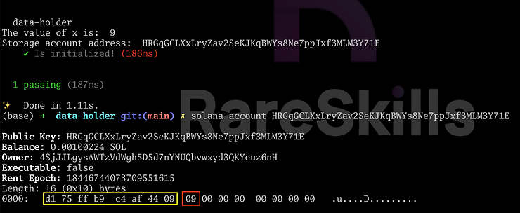
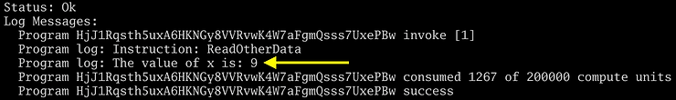
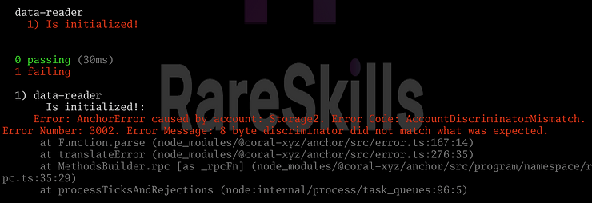
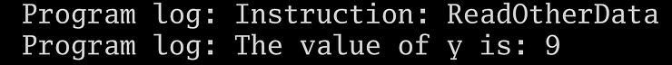
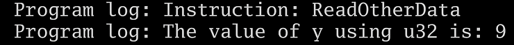
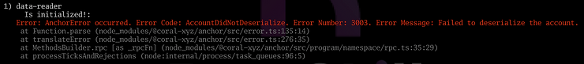

[Reading Another Anchor Program’s Account Data On Chain](https://www.rareskills.io/post/anchor-read-account)

# Reading Another Anchor Program’s Account Data On Chain

In Solidity, reading another contract’s storage requires calling a `view` function or the storage variable being public. In Solana, an off-chain client can read a storage account directly. This tutorial shows how an on-chain Solana program can read the data in an account it does not own.

We will set up two programs: `data_holder` and `data_reader. data_holder` will initialize and own a PDA with data that `data_reader` will read.


## Set up the `data_holder` program storing the data: Shell 1

The following code is a basic Solana program that initializes account `Storage` with `u64` field `x` and stores the **value 9** in it at initialization:

**Typescript code:**
```typescript    
import * as anchor from "@coral-xyz/anchor";
import { Program } from "@coral-xyz/anchor";
import { DataHolder } from "../target/types/data_holder";

describe("data-holder", () => {
  anchor.setProvider(anchor.AnchorProvider.env());

  const program = anchor.workspace
    .DataHolder as Program<DataHolder>;

  it("Is initialized!", async () => {
    const seeds = [];
    const [storage, _bump] = anchor.web3.PublicKey.findProgramAddressSync(
        seeds,
        program.programId
      );

    await program.methods
      .initialize()
      .accounts({ storage: storage })
      .rpc();

    storageStruct = await program.account.storage.fetch(
      storage
    );

    console.log(
      "The value of x is: ",
      storageStruct.x.toString()
    );

    console.log("Storage account address: ", storage.toBase58());
  });
});
```


The test will print out the address of the PDA, we will refer to this address shortly:




## Reader

For the `data_reader` to read another account, that public key of that account needs to be passed as part of the transaction via the **`Context` struct**. This is no different from passing any other kind of account.

Data in accounts is stored as serialized bytes. In order to deserialize the account, the **`data_reader` program** needs a Rust definition of struct it is reading. We will need the following account definition available to `data_reader`, which is identical to the **`Storage` struct** in `data_holder`:

```rust
#[account]
pub struct Storage {
    x: u64,
}
```

This struct is perfectly identical to the one in `data_reader` — even the name must be the same (we will get into the details of why later). The code to read the account is in the following two lines:

```rust
let mut data_slice: &[u8] = &data_account.data.borrow();

let data_struct: Storage =
    AccountDeserialize::try_deserialize(
        &mut data_slice,
    )?;
```

The `data_slice` is the raw bytes of the data in the account. If you run `solana account <pda address>` (using the PDA address generated when we deployed `data_holder`) you can see the data there, including the number 9 we stored in the **`red` box**:



The first 8 bytes in the **`yellow` box** are the account discriminator, which we will describe later.

The deserialization happens at this step:
```rust
let data_struct: Storage =
    AccountDeserialize::try_deserialize(
        &mut data_slice,
    )?;
```

Passing the **type `Storage`** (the same struct we defined above) here tells Solana how to (try) to deserialize the data.

Now let’s create a separate anchor project in a new folder `anchor new data_reader`.

> `abf init day_32_data_reader`

**Here is the complete Rust code:**
```rust
use anchor_lang::prelude::*;

declare_id!("HjJ1Rqsth5uxA6HKNGy8VVRvwK4W7aFgmQsss7UxePBw");

#[program]
pub mod data_reader {
    use super::*;

    pub fn read_other_data(
        ctx: Context<ReadOtherData\>,
    ) \-> Result<(){

            let data_account = &ctx.accounts.other_data;

        if data_account.data_is_empty() {
            return err!(MyError::NoData);
        }

        let mut data_slice: &[u8] = &data_account.data.borrow();

        let data_struct: Storage =
            AccountDeserialize::try_deserialize(
                &mut data_slice,
            )?;

        msg!("The value of x is: {}", data_struct.x);

        Ok(())
    }
}
#[error_code]
pub enum MyError {
    #[msg("No data")]
    NoData,
}

#[derive(Accounts)]
pub struct ReadOtherData<'info\{
    /// CHECK: We do not own this account so
    // we must be very cautious with how we
    // use the data
    other_data: UncheckedAccount<'info\>,
}

#[account]
pub struct Storage {
    x: u64,
}
```

And here is the test code to run it. Be sure to change the address of the PDA in the code below:

```typescript
import * as anchor from "@coral-xyz/anchor";
import { Program } from "@coral-xyz/anchor";
import { DataReader } from "../target/types/data_reader";

describe("data-reader", () => {
  anchor.setProvider(anchor.AnchorProvider.env());

  const program = anchor.workspace
    .DataReader as Program<DataReader\>;

  it("Is initialized!", async () => {
    // CHANGE THIS TO THE ADDRESS OF THE PDA OF
    // DATA ACCOUNT HOLDER
    const otherStorageAddress =
      "HRGqGCLXxLryZav2SeKJKqBWYs8Ne7ppJxf3MLM3Y71E";

    const pub_key_other_storage = new anchor.web3.PublicKey(
      otherStorageAddress
    );

    const tx = await program.methods
      .readOtherData()
      .accounts({ otherData: pub_key_other_storage })
      .rpc();
  });
});
```

To test out reading another accounts’ data:

1. Run the test `data_holder` with the `solana-test-validator` running in the background.
2. Copy and paste the printed **public key** of the **`Storage` account**
3. Put that **public key** into the `otherStorageAddress` of the test for `data_reader`
4. Run the Solana logs in another shell
5. Run the test for `data_reader` to read the data.

The following should be visible in the Solana logs:




### What happens if we don’t give the structs the same name?

If you change the **`Storage` struct** in `data_reader` to a name other than `Storage`, say `Storage2` and try to read the account, the following error will occur:



The account discriminator computed by Anchor is the the first eight bytes of the sha256 of the struct name. **The account discriminator does not depend on the variables in the struct.**

When Anchor reads the account, it checks the first eight bytes (the account discriminator) to see if it matches the account discriminator of the struct definition it is using locally to deserialize the data. If they do not match, Anchor will not deserialize the data.

Checking the account discriminator is a safeguard against the client accidentally passing in the wrong account or an account whose data is not in the format Anchor is expecting.


## Deserializing will not revert if parsing a larger struct

Anchor _only_ checks if the account discriminator matches — it does not validate the fields inside the account being read.


### Case 1: Anchor does not check if the struct field name matches

Let’s change **`x` field** in the **`Storage` struct** in `data_reader` to `y`, leaving the **`Storage` struct** in `data_holder` unchanged:

```rust
// data_reader

#[account]
pub struct Storage {
    y: u64,
}
```

We will also have to change the log line as follows:

```rust
msg!("The value of y is: {}", data_struct.y);
```

When we re-run the test, it successfully reads the data:




### Case 2: Anchor does not check the data type

Now let’s change data type of `y` in `Storage` in `data_reader` to `u32` even though the original struct is `u64`.
```rust
// data_reader

#[account]
pub struct Storage {
    y: u32,
}
```

When we run the test, Anchor still successfully parse the account data.



The reason this “succeeded” is because of how the data is laid out:


The `9` in 7 is availabe in the **first bytes** — a `u32` will look for data in the **first 4 bytes** so it will be able to “see” the `9`.

Of course, if we were to store a value in `x` that `u32` cannot hold, such as 2³², then our reading program will print wrong number.

**Exercise:** Reset the validator and **re-deploy `data_holder`** with the value 2³². The way to raise to a power in Rust is `let result = u64::pow(base, exponent)`. For example, `let result = u64::pow(2, 32);` See what value gets logged by `data_reader`.


### Case 3: Parsing more data than is there

The **storage account is 16 bytes large**. It holds:
- **8 bytes for the account discriminator**,
- And 8 bytes for the **`u64` variable**.

If we try to read more data than is there, such as by defining a struct with values that require more than 16 bytes to hold, the deserialization on read will fail:

```rust
#[account]
pub struct Storage {
    y: u64,
    z: u64,
}
```

The struct above requires **16 bytes to store y and z**, but an additional **8 bytes** are needed to hold the **account discriminator**, making the account **24 bytes** large.




## Parsing Anchor account data summary

When reading the data from an external account, Anchor will check if the account discriminator matches and that there is enough data in the account to be deserialized into the struct used as the type for `try_deserialize`:
```rust
let data_struct: Storage =
    AccountDeserialize::try_deserialize(
        &mut data_slice,
    )?;
```

**Anchor does not check the names of the variables or their length.**

Under the hood, Anchor does not store any metadata for how to interpret the data in the account. It is simply the bytes of the variables stored end-to-end.


## Not all data accounts follow Anchor’s convention

Solana does not require the use of account discriminators.

Solana programs written in raw Rust — without the Anchor framework — will likely store their data in a way that is not directly compatible with the Anchor’s serialization method which `AccountDeserialize::try_deserialize()` implements.

To deserialize non-anchor data, the dev must know in advance the serialization method used — there is no enforced universal convention in the Solana ecosystem.


## Exercise caution when reading data from arbitrary accounts

Solana programs are upgradeable by default. The manner in which they store data in their accounts could change at any time which could break the program that is reading from them.

Accepting data from arbitrary accounts is dangerous — one should generally check the account is owned by a trusted program before reading the data from it.